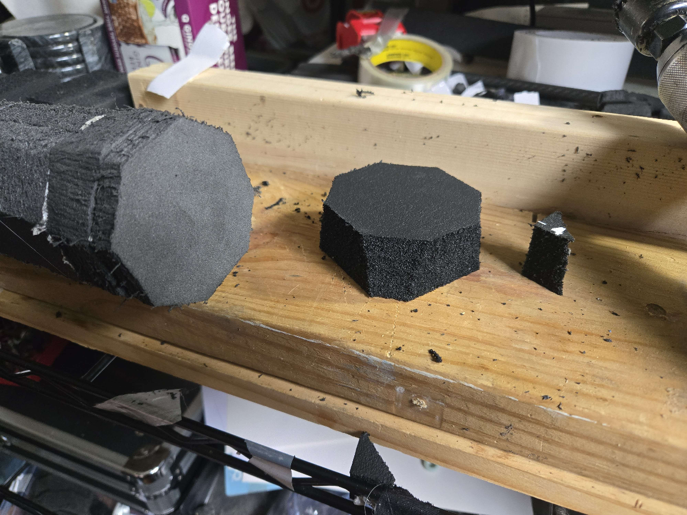

# Stab-Only Dagger

### 1. Cut your core to the desired length, accommodating space for a pommel, handle, and a foundation for the stab tip.

Because these are so small, it almost does not matter at all what you use for a core. You could use any of the recommended sizes of[ Fiberglass Rods](https://docs.foamdom.com/materials/cores#fiberglass-rods), [Fiberglass Tubes](https://docs.foamdom.com/materials/cores#fiberglass-tubes), [Carbon](https://docs.foamdom.com/materials/cores#carbon), or even [PVC ](https://docs.foamdom.com/materials/other#pvc)and shouldn't have any issues with durability or weight. Generally, people use offcuts from other projects to make these.

* Allocate at least 1" for the pommel to attach to the core.
  * This is easier if you leave 1.5".
* Allocate at least 4" for the handle.
  * 5"-7" is generally a more comfortable length of handle.
  * Mock up your handle length before cutting your core to find your own personal sweet spot, making sure to test the sizing while wearing your usual fighting gloves.
* Allocate at least 1" for the stab tip foundation to attach to the core.
  * This is easier if you leave 2".

At this point you should have a section of core that is 6" if you are making it as small as reasonably possible, or around 8"-9". If you are making a min-dagger, you will need to use extra strapping tape to secure the stab tip foundation to the core before attaching the stab tip itself.&#x20;

<figure><figcaption>
A 6" length of .524 Kitespar.
</figcaption></figure>

### 2. Cut a biscuit and apply it to the tip of your core.

* The biscuit can be round or square, it doesn't matter, it will be compressed around the core.
* The biscuit should be twice the diameter of the core.
* Make sure to apply strapping tape to affix the biscuit to the core.
  * Cut a piece of strapping tape 1/2" to 1" across and about 5" to 6" long, lay the center on top of the biscuit, then pull down tightly on either end while you lay the rest down the core.
  * Do the same thing with a 2nd piece of strapping tape, but perpendicular to the first.

<figure><figcaption></figcaption></figure>

### 3. Cut 4 discs for the "can" and stab tip foundation.

* These should be 2.75"-3" in diameter and made out of a 2lb foam, like Camp Pads or 2# XLPE.
* Punch holes through the middle of 2 of them that are the size of the core.
* Cut a hole in 1 of them that is 1.75" in diameter.

<figure><figcaption></figcaption></figure>

### 4. Build the can.

* Slide the first disc with the core-sized hole onto the core from the bottom.&#x20;
* Apply adhesive between the biscuit, core, and disc.

<figure><figcaption></figcaption></figure>

* Apply adhesive to the bottom of the first disc and the core just below it, then slide on the 2nd disc with a core-sized hole onto the core and place it against the previously applied disc.

<figure><figcaption></figcaption></figure>

* Cut a 1.75" diameter disc of a 4lb foam, like Puzzle Mat or 4# XLPE and insert that in the middle of the 2 lb disc you cut a 1.75" hole in.

<figure><figcaption></figcaption></figure>

* Apply adhesive to the top of the biscuit and the 1st disc you put on the core, then place the disc where you applied the adhesive.
  * This disc and the first disc will sandwich the biscuit and parts may not lay exactly flat, this is fine.&#x20;

<figure><figcaption></figcaption></figure>

* Apply adhesive to the top of the previous disc and lay the last disc on top.
* At this point, depending on the adhesive used, it may be a good idea to apply some tape up the sides of the can to hold the discs together while glue sets up.
* It can also be a good idea to use strapping tape similar to how the biscuit was done, but less taut, to help secure the can to the core.

<figure><figcaption></figcaption></figure>

### 5. Cut 4 discs for the pommel.

* These should be 2.25" in diameter and made out of a 4lb foam, like Puzzle Mat or 4# XLPE.
  * These can be round, square, octagonal, etc. The example shows 2.25" diameter octagons.
* Punch holes through the middle of 3 of them that are the size of the core.

<figure><figcaption></figcaption></figure>

<figure><figcaption></figcaption></figure>

### 6. Assemble the pommel on the core.

* Slide the first disc onto the core, stopping where you intend to have your handle end.
  * A small wrap of tape to act as a stop can be helpful.
* Apply some adhesive between the disc and the core.

<figure><figcaption></figcaption></figure>

* Apply adhesive to the bottom of the 1st disc and the core below it.
* Slide the 2nd disc onto the core and lay it against the 1st.

<figure><figcaption></figcaption></figure>

* Apply adhesive to the bottom of the 2nd disc and the core below it.
* Slide the 3rd disc onto the core and lay it against the 2nd.

<figure><figcaption></figcaption></figure>

* Attach some sort of blunting to the end of the core.
  * I usually use a metal bottle cap, held in place with hot glue. This particular choice not only protects the foam from the core, spreads out the force from the core against that foam, and has a rounded edge that won't eat into the outer disc, but the shape of it and the "teeth" it has also helps prevent it from moving around or coming off the end of the core laterally.
  * A penny or small metal disc will also work, but you will have wanted to apply one of those similarly to the biscuit.
    * You can slide the discs onto the core with no glue, put this blunting on the end, and then slide them down one by one in reverse order, applying adhesive in essentially the same manner.

<figure><figcaption></figcaption></figure>

* Apply adhesive to the bottom disc and lay the final, solid, disc against it.&#x20;
* Similarly to how the biscuit and can were affixed to the core with strapping tape, affix the last disc to the pommel and secure the pommel to the core.
  * The adhesive will do a lot of the work on its own, but this will help make sure things stay in place while it sets and add strength after it does.
  * 2 11" pieces of strapping tape should be enough to center on the end of the pommel and wrap down the sides to the core.

### 7. Cut and apply the stab tip foam.

* Cut a disc of stab tip foam at the same shape/diameter of the discs you used for the can.
  * The best options for stab tip foam are Ensolite and NBR Rubber.
* You will want a 1" thick disc for this. If your foam is only 1/2" thick, cut two discs and layer them together.

<figure><figcaption></figcaption></figure>

* Apply adhesive to the top of the can and then lay the stab tip disc on top of it.
* Apply 2 1" wide, 7" long strips of strapping tape over the top of the stab tip and down the sides of the can to secure the tip and reduce roll.
  * Lay the tape across the top of the stab tip with no tension or slack (you don't want to compress the foam).
  * When you get to the sides of the can, just below the stab tip foam, pull the tape taut as you lay down the rest.
  * Wrap the side of the can in cloth tape to secure that strapping tape.

<figure><figcaption></figcaption></figure>

### 8. Wrap the handle.

* Apply some double sided carpet tape up the length of the handle.
* Wrap the handle with your choice of handle wrap, securing either end with cloth tape to prevent it from unrolling.

<figure><figcaption></figcaption></figure>

### 9. Wrap the pommel and can.

* Apply cloth tape to the pommel and can to cover up the foam.

### 10. Add a cover.

* Cut an octagon that is 3" wider than the diameter of your stab tip out of your choice of cloth.
* Cut a strip of carpet tape down to 1/2" to 1" and wrap that around the can, just below the stab tip foam.
* Place the cover flat on a table, then place the dagger upside down in the center of it.
* On two opposing sides, tack the fabric against the ring of carpet tape.&#x20;
* Do the same to the perpendicular sides.
* This will have created pleats in the cover. Roll these pleats all in the same direction to lay the fabric against the can and then wrap it in cloth tape to secure the cover on the can.

<figure><figcaption></figcaption></figure>
