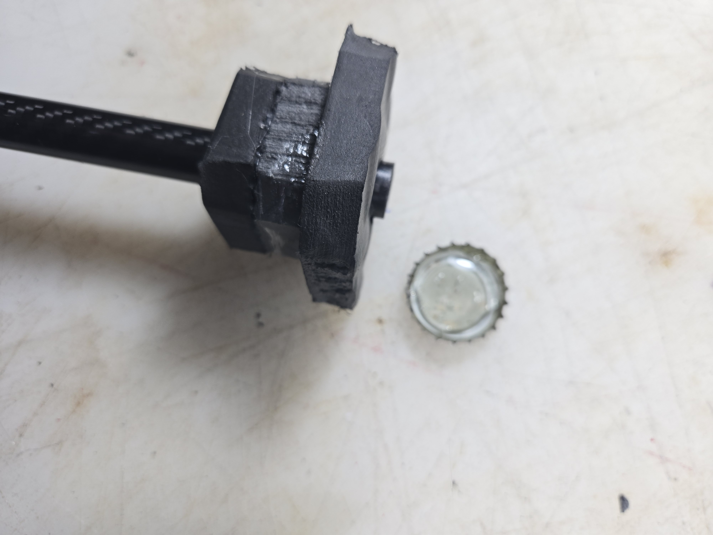
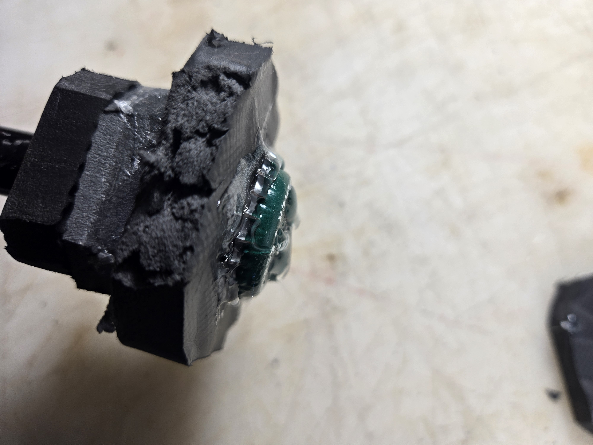

# Stacked Discs

## Incidental & Courtesy Padding

### Prep

<figure><figcaption></figcaption></figure>

<figure><figcaption></figcaption></figure>

<figure><figcaption></figcaption></figure>

### Starting the Stack

For efficiency, we'll start with the more complicated start that comes with making spears/javelins/arrows/daggers. If you're starting under striking surface rather than at the tip of the weapon, you can skip the bits about building around the biscuit before descending down the core with more discs, as everything else is the same regardless of where you start.

<figure><figcaption></figcaption></figure>

<figure><figcaption></figcaption></figure>

<figure><figcaption></figcaption></figure>

<figure><figcaption></figcaption></figure>

<figure><figcaption></figcaption></figure>

<figure><figcaption>
And with this, the biscuit anchor is complete. From here on out, everything is the same as building below striking regions or just adding more to the stack.
</figcaption></figure>

<figure><figcaption></figcaption></figure>

<figure><figcaption></figcaption></figure>

<figure><figcaption></figcaption></figure>

<figure><figcaption></figcaption></figure>

## Pommel

<figure><figcaption></figcaption></figure>

<figure><figcaption></figcaption></figure>

<figure><figcaption></figcaption></figure>

<figure><figcaption></figcaption></figure>

<figure><figcaption></figcaption></figure>

<figure><figcaption></figcaption></figure>

<figure><figcaption></figcaption></figure>

Not shown: place final disc over cap while glue is still hot, and then follow instructions for securing pommels as laid out on the [applying-tape-wraps.md](../applying-tape-wraps.md "mention") page in the [Tip Application](https://docs.foamdom.com/build-techniques/general/applying-tape-wraps#tip-application) section. Will be adding pictures for this section when I do another pommel.&#x20;
