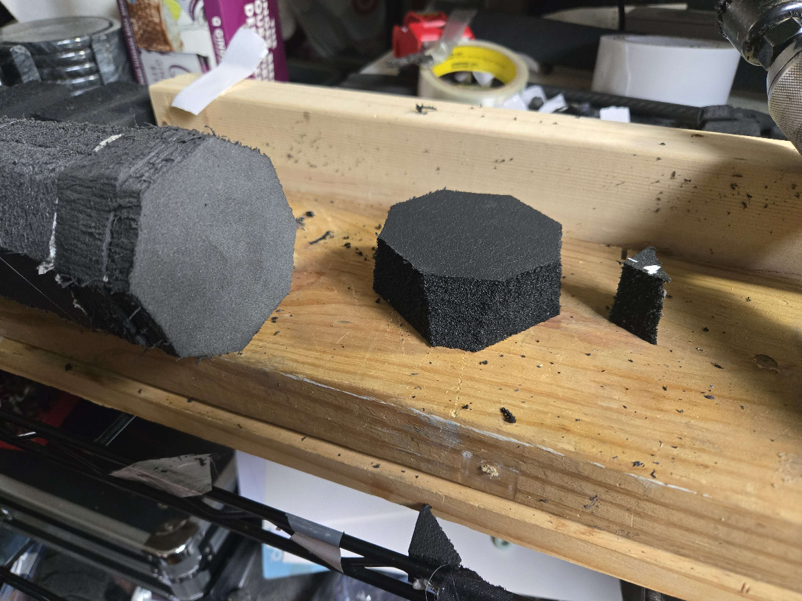

# Omnis

## Foundations

### Double Biscuit and Donut

Uses the [#big-biscuit](../../striking-regions/biscuiting-cores.md#big-biscuit "mention")design for the Biscuit itself, then encloses it with a 1" thick "donut" of 2# XLPE, an additional biscuit to fill in the donut, and a 1/2" cap of 2# XLPE, all adhered with a high-traffic/outdoor carpet tape.

Creates a soft foundation and provides graduated compression below the Stab Tip itself, while also spreading out forces more evenly on thrusts that land.

This could be replicated with other foams, like Ozark Camp Pads "Blue Foam" and Volara, but does best with the more-stable and stiffer 2# XLPE.

#### Building the Double Biscuit

This design assumes that the striking foam is already on your core with the glue dried, and that the end of the striking foam is flush with the bottom of your Biscuit. It calls for an additional 1.25" disc of the same foam you used for the Biscuit (4# XLPE or Puzzle Mat), a 1" thick donut of foam (2# XLPE recommended) cut into the same shape as your blade profile, a 0.5" thick disc of the same foam, and a high-traffic/outdoor Carpet Tape.

<figure><figcaption></figcaption></figure>

In the example, a 1" thick piece of 2# XLPE was used to make the donut, but this could be made from 2 layers of the blue foam from Ozark Camp pads, Volara, etc. While substitutions will still work, and can work well, 2# XLPE in this application will provide more stability and durability than other options.

<figure><figcaption></figcaption></figure>

Instead of using liquid adhesives, I recommend using a resilient double-sided tape for assembling stab tips. With proper reinforcement, this reduces the foam shearing at bonded faces. With liquid adhesives, once a bonded face comes apart, that's permanent damage that needs a repair. With double-sided tape, the bond can still be strong if it comes apart, as long as it comes back into contact. Good double sided tapes will create bonds stronger than the foam over time, as well, which is the only threshold that really matters for adhesive durability.

Apply Carpet Tape to the exposed end of the striking foam and over the biscuit.

I find it is easiest to apply Carpet Tape for irregular shapes like this after splitting it down the middle into 3/4"-1" wide strips.

<figure><figcaption></figcaption></figure>

Remove the backing and fold up any bits of tape that are hanging over the edge back onto the taped surface.

<figure><figcaption></figcaption></figure>

Apply more carpet tape to the sides of the biscuit that were not covered in the previous steps.

<figure><figcaption></figcaption></figure>

Remove the backing and lay the tape down against the surface of the biscuit.

<figure><figcaption></figcaption></figure>

Work the donut down around the biscuit, making sure the inside edges aren't caught on the biscuit and the bottom face is all the way against the end of the striking foam.

You may have to squish and stretch the foam of the donut to get around the biscuit. I find that folding the biscuit slightly, then placing the inside wall against the side of the biscuit and stretching it over and around the rest is simple, easy, and consistently effective.

<figure><figcaption></figcaption></figure>

Apply Carpet Tape to the inside wall of the donut.

<figure><figcaption></figcaption></figure>

Remove the backing and insert the 4# disc into the hole of the donut. Similar to applying the donut, you will have to fold/squish this disc to get it all the way into the hole.

This piece will act like a second biscuit. Unlike the first piece of foam that was put on the core, it won't be compressed by the tension of tape around it, so it will provide graduated compression and, not being compressed perpendicular to the core either, will spread out forces better as well. Both of these will result in a friendlier stab tip.

<figure><figcaption></figcaption></figure>

To finish the stab tip foundation, use an end cap that matches the blade profile, made from the same foam as the donut around the biscuit. This only needs to be 1/2" thick.

Apply carpet tape to one of the faces of this end cap.

<figure><figcaption></figcaption></figure>

Remove the backing from the Carpet Tape and apply the endcap over the donut and "second biscuit". This completes the construction of your Stab Tip foundation.\
\
If you are using a foam like LD15 for your striking foam, it is at this point that I would skin your blade with a housewrap tape, like Tyvec. That skin should be unbroken (5 strips with minor overlap along the length should do it) and come up at least onto the donut around the biscuit.

### Full-Width Discs

Uses 0.5"-1" of 2# XLPE, Ozark Camp Pads "Blue Foam", Volara, etc, stacked on top of the Biscuit. If done with a Biscuit design like the [#big-biscuit](../../striking-regions/biscuiting-cores.md#big-biscuit "mention") and it isn't already inset into the end of the striking foam, would also have a disc cut into a ring to fit around the Biscuit.

This will not be as durable or friendly as the double biscuit design, but is still more than able to make a passing stab tip. Doing the full 1" of padding will improve friendliness, but will be less stable and need more reinforcement than 0.5" would. Foams that require you to use multiple layers to reach 1" will make for a less stable tip and add extra weight in the form of the adhesive needed to bond the extra layer.&#x20;

## Stab Tips

Once a Foundation is in place, the Stab Tip itself can be added. Depending on method, some reinforcement may be appropriate before the Stab Tip, or between the layers that make it up.&#x20;

The best foams for this are:

* [epdm-ethylene-propylene-diene-monomer.md](../../../materials/foam/types-and-sourcing/closed-cell-foams/rubber-foams/epdm-ethylene-propylene-diene-monomer.md "mention")
* [ensolite-nbr-nitrile-butadiene-rubber.md](../../../materials/foam/types-and-sourcing/closed-cell-foams/rubber-foams/ensolite-nbr-nitrile-butadiene-rubber.md "mention")
* 2# XLPE or Minicel L200 ([pe-xlpe-polyethylene](../../../materials/foam/types-and-sourcing/closed-cell-foams/plastic-foams/pe-xlpe-polyethylene/ "mention"))

If you are looking to make the weapon friendlier, a layer of an Open Cell Foam ([charcoal-stub.md](../../../materials/foam/types-and-sourcing/open-cell-foams/charcoal-stub.md "mention")or [lux-stub.md](../../../materials/foam/types-and-sourcing/open-cell-foams/lux-stub.md "mention")) can be helpful.


Some foams that have been used over the years have proven to be very poor for the use but are still often recommended, like the soft EVA in many stadium seats and yoga mats, which will often only be 0.5" thick (which would require you to layer them for best results, reducing stability) and also degrade very quickly. If you've ever repaired a Stab Tip where the foam was completely flattened, this would be why. \
\
Some yoga mats are made with better foams, but are often even thinner. I've seen recommendations to "use yoga mat" result in single layer Stab Tips where that foam layer is 0.25"-0.375" \*to start\*, and essentially might as well not be there.


### Single Layer

A single piece of foam between 0.5" and 1.25" thick. Which thicknesses are appropriate will largely depend on the type of foam and what you're building. Thicker will be friendlier, but less stable and require a more stable foam and/or more reinforcement.&#x20;

Foams and recommended thickness ranges:

* EPDM - 0.5"-1.25" is viable, 0.75"-1" is generally optimal
* NBR - 0.5"-1.25" is viable, 0.75"-1" is generally optimal
* 2# XLPE or Minicel L200 - 0.5"-1" is viable, 0.75"-1" is generally optimal

Other foams break down too quickly and should be avoided.

#### Applying a Single Layer Stab Tip

<figure><figcaption></figcaption></figure>

Apply Carpet Tape to the bottom face of your Stab Tip.

In this example, a 1" thick piece of NBR foam is being used. For additional stability, taking this to 3/4" or 1/2" will still result in an acceptable stab tip, but it will be less friendly.\
\
EPDM foam is a softer option and my preferred option is to use that at 3/4" thickness. Being softer, it will be \*slightly\* less stable, but proper reinforcement will make this moot.\
\
I have also heard good things about using both 2# XLPE and Minicel L200 (which is a special, softer, 2# XLPE). These will be similarly stable to NBR, but will be less elastic and not as springy, which can result in a stiffer-feeling tip on impact.

<figure><figcaption></figcaption></figure>

Remove the backing from the Carpet Tape and apply it to the Stab Tip foundation.

In the image, you can see that the Stab Tip foam flares outward. This is to compensate for when the reinforcement tape compresses the foam slightly on application. Starting with this angled face will leave us with a surface parallel to the striking foam once the reinforcement is in place. This would be less prevalent with a thinner piece of foam.

### Multi Layer

If you really, truly, want to use multiple layers of a foam to get up above 0.5" thick for your Stab Tip, just follow the process for the single layer tip twice, or adhere them together with a liquid adhesive before putting it on the weapon and treat it like it's a single layer tip for installation. I do not recommend this, but it is a viable path.

If you are looking to enhance a stab tip's friendliness by adding a layer of Open Cell Foam, I would get through almost the entire build of the tip, stopping just before the final spiral wrap of fabric tape, and then add it on top of the tape securing the layers below it. Securing it with an additional "x" of fabric tape before doing the spiral wrap is all you'd need, as it wouldn't need anything for stability. Especially for longer weapons, building out a stab tip and then adding 0.5" of [lux-stub.md](../../../materials/foam/types-and-sourcing/open-cell-foams/lux-stub.md "mention")or [charcoal-stub.md](../../../materials/foam/types-and-sourcing/open-cell-foams/charcoal-stub.md "mention")to the end can make a noticeable difference in how it feels to get hung up on the end of the weapon.

## Reinforcement

### The Full Monty

I've been iterating on this design, adapted from what I originally learned in 2015/2016 for reinforcing tips for flat blades, since I first started in foam sports. The widths of the strapping tape, where the tape is in tension, and modifications to make for various goals have all fallen into place across that time and been adjusted as outcomes have been observed and adapted to.&#x20;


For this process, the tension of the tape and which parts of the tape are in tension or just taut, matters greatly. The fiberglass in the tape needs to not have any slack, which means that creases must not occur. The foam needs to not be pre-compressed too much, though some pre-compression is unavoidable. The "anchors" (1"-2" at the ends) of the tape need to not be in tension.


<figure><figcaption></figcaption></figure>

To start, prepare four 13"-15" long strips of 1/2"-3/4" wide strapping tape. It can be helpful to mark the center points of these pieces of tape to make applying them evenly easier. Generally, I just fold the non-adhesive faces against each other and find the center that way, as I apply it to the tip.


If you are worried about stability of the Stab Tip Foundation, which could cause buckling \*below\* the Stab Tip foam on longer Stab Tips if there is a problem, placing two of the four strips of strapping tape before attaching the Stab Tip foam can be a very effective way of mitigating issues. If you are doing an indexed handle, it is best to do this on the "corner" faces.&#x20;

Other than doing this before adding that foam, the only thing to change about the process is to start adding tension immediately after going over the edge from the tip onto the striking surface. It may also behoove you to shorten those pieces of tape by 2X the thickness of your Stab Tip foam so they line up with the others, if you like that sort of thing.


Take one of the pieces, and place the center of the tape over the center of the end of the Stab Tip. Let one half hang loose and lay the other down against the foam surface as shown in the image. Across the top of the Stab Tip and down the side of the Stab Tip foam, lay the tape down taut, but not in tension. Right before you cross from the Stab Tip foam to the Stab Tip foundation, apply tension as you lay down the foam.&#x20;

When you get to the last 1"-2", lay the rest down with no tension. Repeat this with the other side/half of the piece of tape, making sure to have the tension in both sides as even as possible (made easier by looking at the weapon from the side and seeing if the tip is pulling in one direction or the other.

Repeat this with the other strips of tape, starting with the perpendicular angle to the already-applied piece.


If you \*didn't\* do this over Tyvec and used a foam with a low tensile strength like LD15, you will almost definitely see tears at the ends of your anchors develop quickly.


<figure><figcaption></figcaption></figure>

Cover each of the pieces of strapping tape with a piece of Hockey Tape. This should be placed taut, with no tension, avoiding creases. You do not want to add any additional compression of the foam with this tape, as that would bend fibers in the strapping tape. This tape is here as additional reinforcement and to soften the surface.

&#x20;

Once that is done, apply a spiral wrap of Hockey Tape. Start with the tape covering the transition of the stab tip foam and spiral downward until the ends of each of the pieces going over the end of the weapon are covered. This tape should be applied tight, but not so tight that it compresses the foam, except for the "excess" from the Stab Tip foam flaring out (if you did yours that way).



This design ensures that there is minimal strapping tape on the striking surface, that any that is there is covered by something softer, and that there are never more than 3-4 layers of tape covering any area on the striking surface\*. It also provides a more-resilient weapon for tip-heavy combat, as the additional skin of the fabric tape spreads out forces and protects the foam much more than just Tyvec itself would. The wrap also incidentally spreads out the forces of the anchoring strips at the base, which mitigates wear even further at the ends of the anchors.

\* 4 layers if done over Tyvec. This number also doesn't account for the overlap seam of the spiral wrap technically creating an additional layer.

<figure><figcaption></figcaption></figure>

When you are done, you should have 5"-6" of reinforcement at the tip of your weapon. Pay attention to how the part of the Stab Tip foam that is under the spiral wrap of fabric tape is compressed flush with the surface of the striking foam below. This will increase stability and make the compression of the Stab Tip foam more linear. The cover will compress the "corners" that stick out above that and that degree of pre-compression will not be problematic.

### Equilateral Triangle

Instead of 2 offset "x" patterns (or an asterisk), the same process for laying down the tape in varying levels of tension is used to make an equilateral triangle on the end of the weapon, where the tape doesn't build up 4 layers in the middle of the tip. The corners occur right as the tape goes over the edge and onto the striking surface, and the pieces of tape continue on down the sides after crossing each other, about 15-30 degrees off parallel with the core. This can be doubled up and flipped around into a 6 pointed star pattern for more reinforcement.

### Tyvec

I will start by saying that, while this works, I don't actually consider it reinforcement. Tyvec is a great skinning foam, but is prone to splits where foam buckles, which is very much going to work against you in a stab tip at a higher rate of probability than something like Strapping Tape or Hockey Tape would allow.

Follow the same process for laying down the tape in varying levels of tension as with 2 offset "x" patterns of Strapping Tape over the end of the core in the "Full Monty" design but with a 2" wide house wrap tape like Tyvec. This is sometimes done as a single "x".

I've seen this sometimes come with a spiral wrap of fabric tape like is demonstrated in the last step of the "Full Monty" process. This is an improvement, but not much is working to prevent folding and buckling in that tape layup.
