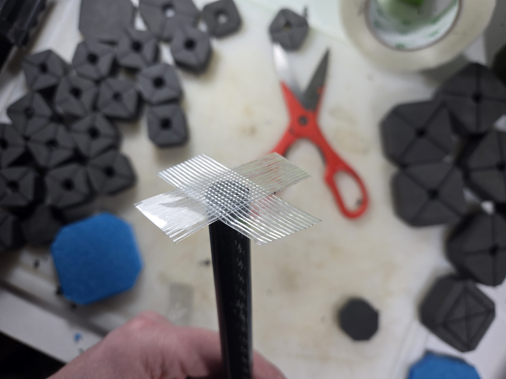
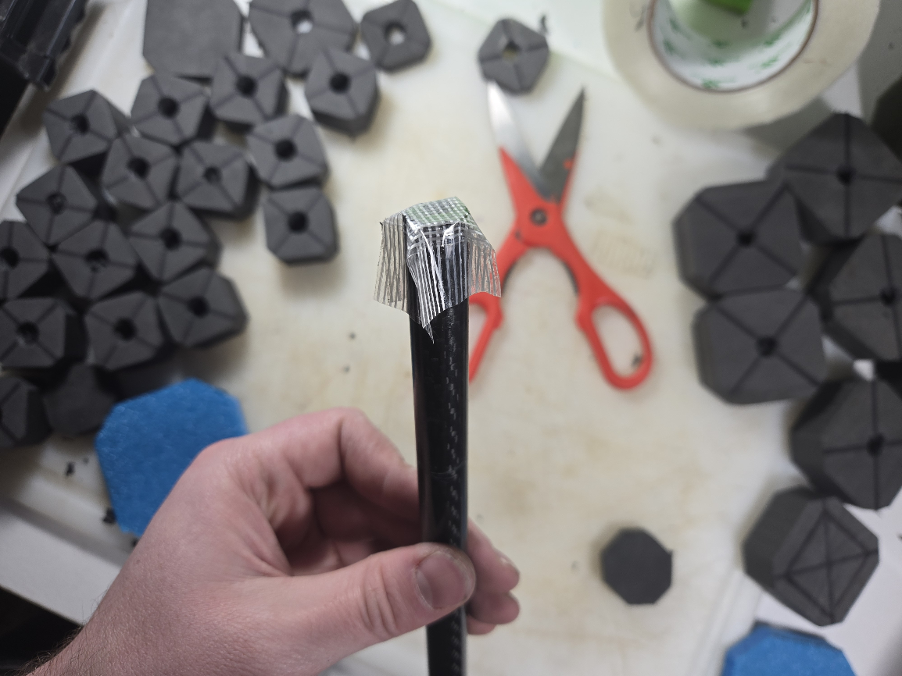
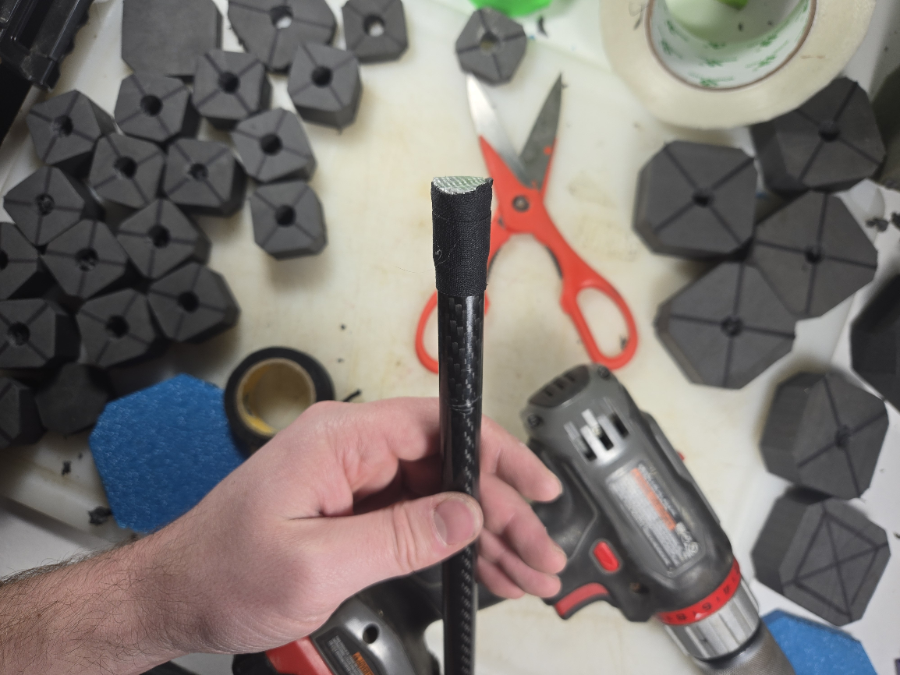
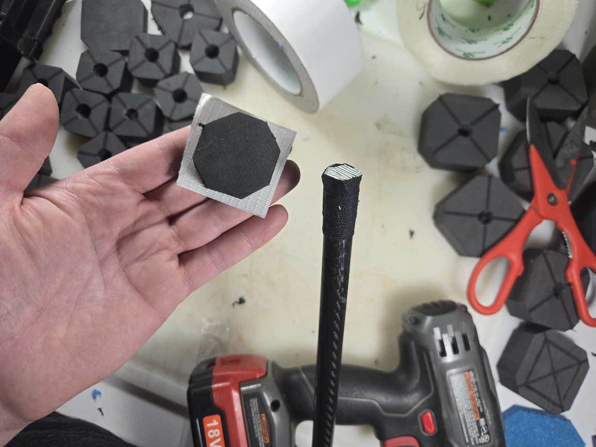
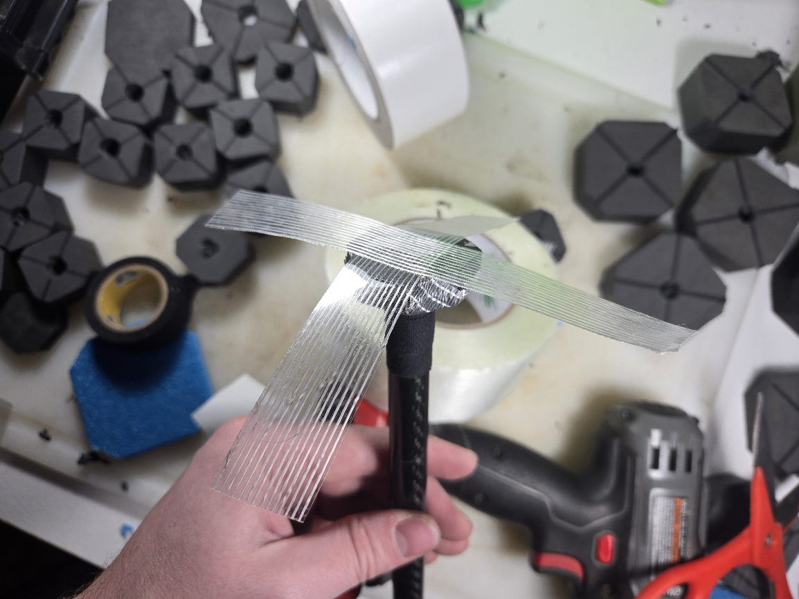
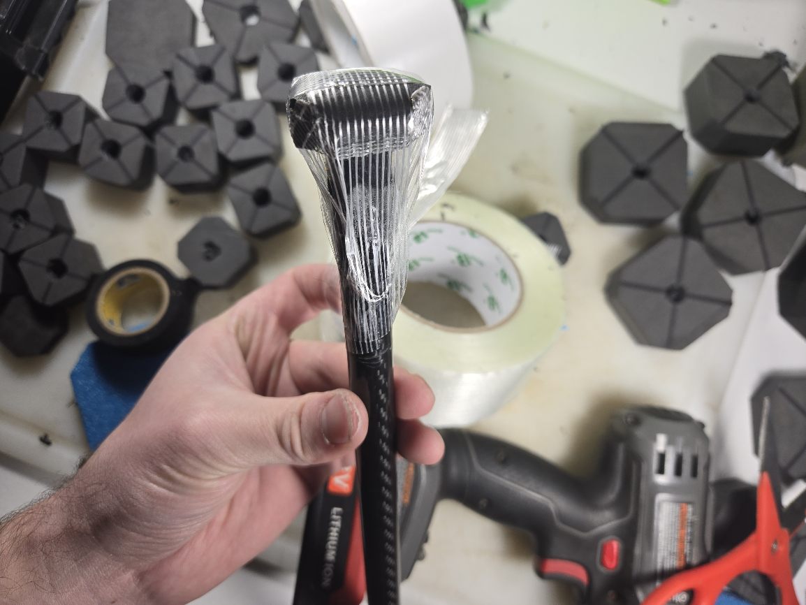
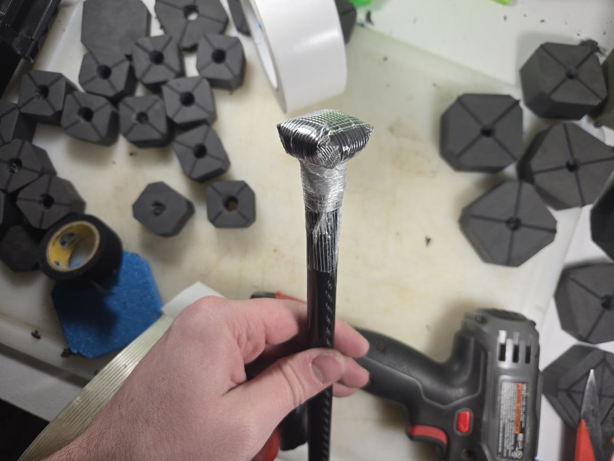
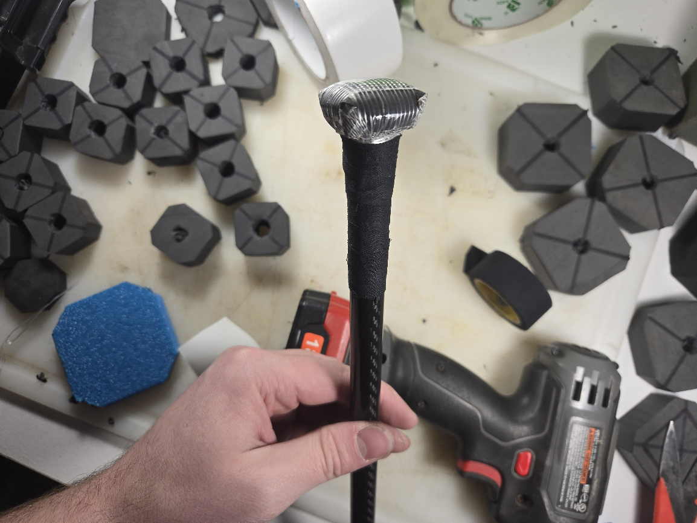

# Biscuiting Cores

### Who Biscuit?

You Biscuit.

### What Biscuit?

A piece of a durable material, generally a foam with a 4# or greater density, that is placed over the end of the core to reduce puncture/escape risks and keep the end of the core from exiting the weapon, and to slow the degradation of the foam that would otherwise have been in direct content with the core.

### When Biscuit?

Adding the Biscuit should be the first step of any build, aside from maybe cutting the core to length (which may be better to save for after building the stab tip if you're trying to hit an exact length).

### Where Biscuit?

The pointy end.

### Why Biscuit?

Using rigid rod or tube as the core of a weapon presents specific risks at the tip of the weapon. Most notably, the risk of it puncturing the foam and protruding out of the structure of the weapon is a huge safety consideration. Even when this would not occur, the foam that interacts with the end of the core will degrade at a faster rate than the foam taking direct impacts in most cases, because of the sharp edges and lack of give.&#x20;

Beveling the edges of solid rods can help with this, but reduces the surface area of the end slightly and increases puncture/escape risks. Even if it's a negligible increase to risk, it's a negligible decrease to how that edge will wear against the foam and it's not an option for hollow tubes, which are the most popular option for a core. Because of that, and because the design plan for this guide handles the problem regardless of your core choice, I would just write this off as an option.

Generally, in weapons with a poorly executed or under-done biscuit, you will see where the end of the core has "chewed out" an area of the foam above it that is much larger across than the core itself. This guide covers methods for mitigating this, providing for spreading out forces on both thrusts and lateral impacts, and for graduated compression on thrusts.

## How Biscuit?

### Big Biscuit

This is my recommended method, which is what is referenced above regarding mitigating specific issues that occur with most traditional methods that I have come across.

#### Step 1: Strapping Tape Buffer

The sharp edges and (often) hollow center of cores will cut into the foam aggressively. To prevent this and make your biscuits and tips last longer, it is important to cover this. Using a fiberglass reinforced tape is the lightest and most durable option.

<figure><figcaption></figcaption></figure>

Take two 2"-3" strips of 3/4"-1" wide Strapping Tape and place them over the end of the core in an "x" pattern.


If you only have 2" strapping tape, you can always put a slit in the end of the tape and just pull it apart to split it into halves, thirds, fourths, etc.


<figure><figcaption></figcaption></figure>

Fold down the ends of each piece of tape firmly with no slack or creases.

It is ok if you get little "wings" as shown in the image, but it is best if there is exposed adhesive on each so they can be laid flat against the core before moving on.

#### Step 2: Secure the Buffer

<figure><figcaption></figcaption></figure>

Do a spiral wrap of either strapping tape or an appropriate fabric tape. This tape should be wrapped very tightly. In the image, Hockey Tape is used; substituting Strapping Tape would be just as viable and lighter weight.&#x20;

This tape will both dull the edges of the end of the core and prevent the biscuit from going inside the hollow.

#### Step 3: Apply the Biscuit

In this example:

* Duck's Indoor/Outdoor Carpet Tape is being used.
  * Unlike the Indoor-only version of this tape, the outdoor version is reinforced with a fiber mesh and the adhesive holds up better in the elements.
* The biscuit is a 1.25" diameter octagon in 3/8" thick 4# XLPE.
  * This larger biscuit folds over the end of the core slightly, increasing lateral stability and reducing wear.
  * The increased surface area allows for a better bond between the biscuit and the foam around it.
  * Generic puzzle mats, which are a firm EVA that is effectively equivalent to 4# XLPE (just not as soft), are a non-problematic substitution, here.

<figure><figcaption></figcaption></figure>

Take your biscuit and apply an appropriate double sided tape to one face. Rather than just placing the biscuit and taping it down, having this in place will help keep it laterally stable, further reducing wear.&#x20;

After removing the backing, place the taped face against the taped end of the core, making sure it is centered. This is often most easily done by setting the Biscuit down tape-face up, and then placing the core against that face, rather than setting the biscuit "on top" of the core.


Overkill Option: Before applying the Carpet Tape to the Biscuit, you can skin the bottom face with strapping tape to make it even more resilient against the core cutting into the foam. If your Carpet Tape has no fiber mesh, I would recommend this. A single layer should suffice in either instance.


#### Step 4: Secure the Biscuit

<figure><figcaption></figcaption></figure>

Take two 6-7" strips of 1/2"-3/4" wide strapping tape and place them in an "x" over the top of the biscuit.

<figure><figcaption></figcaption></figure>

Pull the ends of the strips of Strapping Tape down to the core, laying their ends flat and avoiding creating "wings".

This needs to be done in tension, and the biscuit must remain evenly centered on the end of the core as you do it. Because of this, it is often easiest to pull opposite ends down at the same time.

When finished, it should look like the image, with the biscuit bent slightly around the end of the core, and all but the last 1/2" or so of the tape "bridged" and not attached to a surface.

<figure><figcaption></figcaption></figure>

Starting where the tape begins to bridge and come away from the core and going up to just below the biscuit, do a spiral wrap of 1/2"-3/4" wide strapping tape. This needs to be done very tightly, pulling the bridged tape from the previous step tight to the core and locking the biscuit in place.

#### Step 5: Prepare Taped Region of Core for Adhesives

To finish the biscuit assembly, it is important to prepare it for adhesives. Good Strapping Tape will adhere well to itself, but does not do well when having adhesive applied to it. This is both a problem of the liquid adhesive breaking down the adhesive in the tape if it works its way under it and of adhesive not always adhering well to the plastic backing. In the case of it breaking down the tape adhesive this could cause it to slip and lose tension or shift before it cures.

Fabric tapes, especially Hockey Tape, are a great fix for this. They adhere well to themselves and strapping tape, and provide an absorbent, textured, surface for adhesives. Applied in a tight spiral wrap, the tension in the tape will hold it even more secure.

<figure><figcaption></figcaption></figure>

Apply a spiral wrap of an appropriate fabric tape in tension to cover the plastic-backed tape, stopping flush with the bottom of the biscuit.


It can also be beneficial to cover the bottom and side faces of the biscuit, but this shouldn't be done as part of the spiral wrap.


### Other Methods and Relevant Techniques

#### Tiny Biscuits

Most often, I see biscuits where the foam piece is the same diameter as, or just slightly larger than, the core. These tend to come off the end of the core easily, or just aren't effective long term because they protect a much smaller area of the foam above/around them. This is especially so when they are just glued on, or taped down without that tape then having a spiral wrap to secure it in place, etc.\
\
Sometimes this is done on hollow cores with no tape covering the end of the core, which just leads to these biscuits ending up inside the core and not doing their job at all. Duct tape as the buffer often doesn't last and will still allow this to happen eventually.

Even worse, many of these are made using the same foam as the striking region and the foam being placed above the Biscuit to make the Stab Tip foundation. These might as well not be there, as they will be crushed out very early in the life of the weapon.

For these reasons, I can't recommend any method that relies on these. There are many examples of builds in the wild that have been successful and weapons that have lasted a long time with tiny Biscuits, but there are too many lost opportunities for increased durability, safety, and friendliness when going that route.

#### "Full Coverage" Biscuits

Every so often, instead of a cap over the end of the core, I've seen someone take a disc of 4# XLPE or Puzzle Mat that is the same diameter/shape as their striking region and, after applying their striking foam flush to the end of the core, place that on the end of their striking foam/core.

There are multiple caveats with this design.

* You've taken a stiff foam all the way to the striking surface. This will make your weapon less friendly, and in a spot that generally already suffers from over-taping in for many newbie builds. Any advantages this would give for durability are more than lost to the weapon hurting more to get hit with.
* No anchoring of the biscuit to the core. None of the advantages that come from anchoring the biscuit to the core, such as increased surface area and a pliable surface to bond to for the softer, less durable foams, is lost. Stability increases from the Big Biscuit design do not come into play, and you are doing little to spread out forces because the larger piece of foam will just deform in the middle, as it has freedom to stretch across that wider area it covers.
* No protection for the foam against the "biscuit" layer. Because the core will be able to move relative to the surface of the foam above it, it will chew into this foam and degrade it faster.

For these reasons, I can't recommend any method that relies on this design.

#### Leather as a Biscuit

This can be an effective buffer, and is largely a more-durable, more-flexible, version of using the 4# XLPE or Puzzle Mat when used at the same 1.25" diameter. It doesn't contribute to graduation compression for thrusts, though, and isn't truly \*more\* effective than just putting strapping tape on the bottom face of a Big Biscuit.

If you have scrap leather, mounting a piece on the end of the core before applying a foam Biscuit wouldn't likely hurt, and it might make the Biscuit last longer by creating a less-aggressive edge. I don't know that I could justify using non-scrap leather for this, even to reach for an "upgrade".&#x20;

At the very least, I can't recommend leather \*alone\* as a Biscuit.

#### Tape as a Biscuit

You're lying to yourself. Stop.
