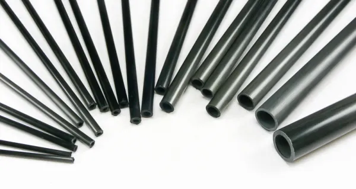
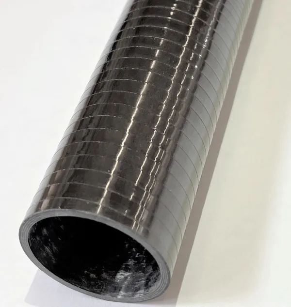

# Cores

## Overview

Cores are the foundation of a weapon and are often the longest lasting part, with striking surfaces being replaced multiple times before a good core wears out. The most common items we see used for cores are fiberglass rods and tubes, carbon rods and tubes, graphite, and wrapped carbon tubes.&#x20;

Below are breakdowns of commonly used cores. As for general recommendations:

_Note: PVC and Bandshoppe used to be popular options, but they are far outshone by newer choices and are not included. The_ [#pvc](other.md#pvc "mention") _(_[other.md](other.md "mention")_) and_ [pvc-tubes.md](../weapon-storage/pvc-tubes.md "mention") _(_[Broken link](broken-reference "mention")_) pages may be helpful to you if you are still interested in PVC as a material._

<table><thead><tr><th width="252">Core Type</th><th>Notes</th></tr></thead><tbody><tr><td>1/2" Fiberglass Rod</td><td><ul><li>Very durable, but heavy. </li><li>Ok in a pinch or for weapons where weight isn't a concern. </li><li>Good for weapons up to 60".</li><li>Can be found in stores.</li><li>Should be upgraded to .524 or .602 kitespar, if possible.</li></ul></td></tr><tr><td>.500" Fiberglass Tube</td><td><ul><li>Lightweight, and relatively affordable.</li><li>Good for weapons up to 30".</li><li>Special order only.</li></ul></td></tr><tr><td>.524" Fiberglass Tube</td><td><ul><li>Lightweight, and relatively affordable.</li><li>Stronger and stiffer than .500" Fiberglass.</li><li>
Good for weapons up to 42"
<ul><li>48" when clad with quartered 1/2" PVC.</li></ul></li><li>Special order only.</li></ul></td></tr><tr><td>.602" Fiberglass Tube</td><td><ul><li>Lightweight, and relatively affordable.</li><li>Stronger and stiffer than .524" Fiberglass.</li><li>Good for weapons from 42" to 65".</li><li>Special order only.</li></ul></td></tr><tr><td>.500" Carbon Tube</td><td><ul><li>Extremely lightweight, but more expensive.</li><li>Stronger and stiffer than .524" Fiberglass.</li><li>Good for weapons up to 48".</li><li>Special order only.</li></ul></td></tr><tr><td>.625" Carbon Tube</td><td><ul><li>Extremely lightweight, but more expensive.</li><li>Stronger and stiffer than .500" Carbon.</li><li>Available with multiple inner diameters, with the thicker walled option being stronger.</li><li>Good for weapons from 48" to 72".</li><li>Special order only.</li></ul></td></tr><tr><td>Wrapped Carbon Tubes</td><td><ul><li>Extremely lightweight, but more expensive and heavier than unwrapped carbon tubes.</li><li>Stronger and stiffer than unwrapped tubes.</li><li>Available with various wraps, each with different properties, some stronger than others.</li><li>Custom wraps can be ordered from some vendors.</li><li>
Good for weapons up to 144", depending on wrap.
<ul><li>Swung weapons up to 96"</li><li>Thrusting-only weapons up to 144"</li></ul></li><li>Special order only.</li></ul></td></tr><tr><td>Graphite</td><td><ul><li>Absurdly lightweight.</li><li>Generally found as old graphite golf clubs, so are inexpensive, but are short and tapered. </li><li>Not as durable as Fiberglass Tubes.</li><li>Good for weapons under 36".</li><li>Can be found at thrift stores.</li></ul></td></tr></tbody></table>

## Fiberglass

The most common material found in cores at this time in the sport. 1/2" rods and tubes being the primary choice for weapons under 48" long. A rod is going to be both stronger and heavier than a tube of the same diameter, while it is often ideal to reduce weight as much as possible via using a tube, some weapons may benefit from the extra weight and durability offered by a rod.&#x20;

### Fiberglass Rods

<figure><figcaption>
Assorted Fiberglass Rods
</figcaption></figure>

Fiberglass rods can generally be purchased at hardware stores, farm supply stores, and the like. Because you generally have to order fiberglass tubes online, rods can be a great option for inexpensively and quickly getting started making weapons for foam fighting. That said, if you need lengths beyond 48" or need to keep weight down, you are generally going to need to place an online order and might as well get the appropriate tube or upgrade to a carbon core. Rods can generally be found in-stores in 3 sizes:&#x20;

3/8", sold as driveway markers, is the most common and easiest to find. 3/8" rods have largely been phased out due to issues with flex on longer weapons, I could only find myself recommending them for coring cheap stab-only daggers or short weapons made for kids that would never see an adult duel or the field.

1/2", sometimes referred to as 'pig post', is a bit harder to find. I've found that farm supply stores like Thiesen's and Farm n' Fleet are the only places that carry them in my metro. A 1/2" fiberglass rod could reasonably be used to make a weapon up to 60" long before you begin to run into flex issues, and you'll generally find them in 48" or 60" lengths.\
\
11/16" is generally also found only at farm supply stores. I can't recommend using these for anything. They are heavy and generally don't come in lengths over 60", which makes them effectively obsolete.

### Fiberglass Tubes

<figure><figcaption>
Assorted Kitespar
</figcaption></figure>

Fiberglass tubes, often referred to as "kitespar", are the best value core option. They are extremely lightweight, allowing you a great deal of control over the weight distribution of the weapon, while still being strong enough to be used for the sport. While more expensive than rods and requiring placing an online order, the quality of life improvement that comes from using kitespar over solids more than makes it worth it in most situations. There are 2 sizes of fiberglass tube that are relevant to our sport:

505 and 524 Kitespar are both just over 1/2" in diameter with 524 being slightly larger. 505 starts to become too flexible at lengths beyond 33" and 524 after 42".\
\
It is possible to make very durable 48" weapons with 524 kitespar by cladding 3/4 of the length with quartered 1/2" PVC on two sides, though you will have a weight floor around 14oz for a max blue and less control over dispersal than if you just upgraded to 602.

602 Kitespar, just over 0.6", is what would generally be recommended for making weapons longer than 42" but under 65". The near-25% increase in the diameter of the tube drastically increases the resistance to flex and overall strength.

### Sources

_As of Sept, 2025,_ [_Cold Mountain Company_](https://www.etsy.com/shop/ColdMountainCompany) _is by far the best price per inch, per core, and for shipping for all forms of kitespar._&#x20;

<table data-header-hidden><thead><tr><th width="229">Name</th><th width="257" align="center">Source</th><th>Link</th></tr></thead><tbody><tr><td>3/8" Fiberglass Rods (Driveway Marker)</td><td align="center">Walmart</td><td><a href="https://www.walmart.com/ip/HY-KO-48-Fiberglass-Reinforced-Driveway-Marker-Reflector/17011295">https://www.walmart.com/ip/HY-KO-48-Fiberglass-Reinforced-Driveway-Marker-Reflector/17011295</a></td></tr><tr><td>3/8" Fiberglass Rods (Driveway Marker)</td><td align="center">Home Depot</td><td><a href="https://www.homedepot.com/p/Everbilt-48-in-Orange-Ground-Mount-Reflective-Rod-31474/304685319">https://www.homedepot.com/p/Everbilt-48-in-Orange-Ground-Mount-Reflective-Rod-31474/304685319</a></td></tr><tr><td>1/2" Fiberglass Rods (5')</td><td align="center">Theisen's</td><td><a href="https://www.theisens.com/products/power-wizard-fiberglass-round-post12-x-5">https://www.theisens.com/products/power-wizard-fiberglass-round-post12-x-5</a></td></tr><tr><td>.505 Kitespar (54.5")</td><td align="center">Fly Market Kites</td><td><a href="https://www.flymarketkites.com/filament-wound-epoxy-tubes/fl505-filament-wound-epoxy-tube">https://www.flymarketkites.com/filament-wound-epoxy-tubes/fl505-filament-wound-epoxy-tube</a></td></tr><tr><td>.524 Kitespar (54.5")</td><td align="center">Fly Market Kites</td><td><a href="https://www.flymarketkites.com/filament-wound-epoxy-tubes/fl524-filament-wound-epoxy-tubes">https://www.flymarketkites.com/filament-wound-epoxy-tubes/fl524-filament-wound-epoxy-tubes</a></td></tr><tr><td>.505 Kitespar (32")</td><td align="center">Cold Mountain Company</td><td><a href="https://www.etsy.com/listing/681720878/505-kitespar-hollow-cores">https://www.etsy.com/listing/681720878/505-kitespar-hollow-cores</a></td></tr><tr><td>.524 Kitespar (42")</td><td align="center">Cold Mountain Company</td><td><a href="https://www.etsy.com/listing/584760330/524-kitespar-hollow-cores">https://www.etsy.com/listing/584760330/524-kitespar-hollow-cores</a></td></tr><tr><td>.602 Kitespar (60")</td><td align="center">Cold Mountain Company</td><td><a href="https://www.etsy.com/listing/1667503763/602-kitespar-hollow-cores-60">https://www.etsy.com/listing/1667503763/602-kitespar-hollow-cores-60</a></td></tr><tr><td>.505 Kitespar (54.5"-75") FL-505</td><td align="center">Goodwinds* Filament Wound Epoxy Tubes</td><td><a href="https://goodwinds.com/product-category/carbon-fiberglass/fiberglass/filament-wound-epoxy-tubing/">https://goodwinds.com/product-category/carbon-fiberglass/fiberglass/filament-wound-epoxy-tubing/</a></td></tr><tr><td>.524 Kitespar (54.5"-75") FL-524</td><td align="center">Goodwinds* Filament Wound Epoxy Tubes</td><td><a href="https://goodwinds.com/product-category/carbon-fiberglass/fiberglass/filament-wound-epoxy-tubing/">https://goodwinds.com/product-category/carbon-fiberglass/fiberglass/filament-wound-epoxy-tubing/</a></td></tr><tr><td>.602 Kitespar (60"-84") FL-602</td><td align="center">Goodwinds* Filament Wound Epoxy Tubes</td><td><a href="https://goodwinds.com/product-category/carbon-fiberglass/fiberglass/filament-wound-epoxy-tubing/">https://goodwinds.com/product-category/carbon-fiberglass/fiberglass/filament-wound-epoxy-tubing/</a></td></tr><tr><td>Various (33"-72")</td><td align="center">Gorg The Blacksmith</td><td><a href="https://www.gorgtech.com/shop/weapon-core-only/">https://www.gorgtech.com/shop/weapon-core-only/</a></td></tr></tbody></table>

***

## Carbon

<figure><figcaption>
Chip Charcoal
</figcaption></figure>

Carbon can be seen as a straight upgrade from [#fiberglass](cores.md#fiberglass "mention"). It is lighter (a 1/2" carbon rod weighs about 3.25 oz at 60" long) and stronger, both being more durable and resisting flex better. Because they are something that has to be special ordered, and solid carbon rods weighing much more than their hollow fiberglass counterparts, solid carbon rods can largely be ruled out.&#x20;

### Tubes

<figure><figcaption>
Assorted Carbon Tubes
</figcaption></figure>

1/2" tubes are sufficient for max blues and min-reds, but there are also multiple variants of .6"-.7" tubes with different inner diameters (with thicker walls making for stronger and heavier tubes) that can be used for longer weapons and increased strength.&#x20;

### Wrapped Tubes

<figure><figcaption>
A spiral wrapped carbon tube
</figcaption></figure>

Carbon tubes with further carbon or fiberglass reinforcement. These wraps are generally either a spiral wrap, braid, or twill pattern. Wrapped carbon tubes can often end up just slightly thicker than their designated size due to the wrap, and 1/2" options may have an outer diameter of closer to .6" depending on the thickness of the wrap, or because the vendor has them labeled by inner diameter. Different wraps produce different results, pay attention to the product descriptions on vendor sites.

### Sources

<table data-header-hidden><thead><tr><th width="315">Name</th><th width="154" align="center">Source</th><th>Link</th></tr></thead><tbody><tr><td>1/2" Carbon Tubes</td><td align="center">Fly Market Kites</td><td><a href="https://www.flymarketkites.com/pultruded-carbon-tubes/500-pultruded-carbon-tube">https://www.flymarketkites.com/pultruded-carbon-tubes/500-pultruded-carbon-tube</a></td></tr><tr><td>1/2" Carbon Tubes (24"-60") .500" Pultruded Carbon Tube</td><td align="center">Goodwinds*</td><td><a href="https://goodwinds.com/product-category/carbon-fiberglass/carbon/pultruded-tubes/">https://goodwinds.com/product-category/carbon-fiberglass/carbon/pultruded-tubes/</a></td></tr><tr><td>1/2" Wrapped Carbon Tube (60") WCT .500" - Standard Modulus</td><td align="center">Goodwinds*</td><td><a href="https://goodwinds.com/product/wct-500-x-60-wrapped-carbon-tube/">https://goodwinds.com/product/wct-500-x-60-wrapped-carbon-tube/</a></td></tr><tr><td>1/2" Wrapped Carbon Tube (60") WCT .500" - Intermediate Modulus</td><td align="center">Goodwinds*</td><td><a href="https://goodwinds.com/product/wct-500-x-60-wrapped-im-carbon-tube/">https://goodwinds.com/product/wct-500-x-60-wrapped-im-carbon-tube/</a></td></tr><tr><td>1/2" Wrapped Carbon Tube (60") WCT .500" - Twill</td><td align="center">Goodwinds*</td><td><a href="https://goodwinds.com/product/wct-500-x-60-wrapped-twill-carbon-tube/">https://goodwinds.com/product/wct-500-x-60-wrapped-twill-carbon-tube/</a></td></tr><tr><td>Various (58"-92.5")</td><td align="center">Gorg The Blacksmith</td><td><a href="https://www.gorgtech.com/shop/weapon-core-only/">https://www.gorgtech.com/shop/weapon-core-only/</a></td></tr><tr><td>0.625″ X 0.741″ Standard Modulus Carbon Fiber Tube (36"-96")</td><td align="center">Clearwater Composites</td><td><a href="https://www.clearwatercomposites.com/product/5-8-x-0-741-carbon-fiber-tube/">https://www.clearwatercomposites.com/product/5-8-x-0-741-carbon-fiber-tube/</a></td></tr><tr><td>3/8″ X 1/2″ Standard Modulus Carbon Fiber Tube (36"-96")</td><td align="center">Clearwater Composites</td><td><a href="https://www.clearwatercomposites.com/product/3-8-x-1-2-carbon-fiber-tube/">https://www.clearwatercomposites.com/product/3-8-x-1-2-carbon-fiber-tube/</a></td></tr><tr><td>1/2″ X 5/8″ Standard Modulus Carbon Fiber Tube (36"-96")</td><td align="center">Clearwater Composites</td><td><a href="https://www.clearwatercomposites.com/product/1-2-x-5-8-carbon-fiber-tube/">https://www.clearwatercomposites.com/product/1-2-x-5-8-carbon-fiber-tube/</a></td></tr></tbody></table>

***

## Graphite

Generally, graphite cores are graphite golf clubs or similar that are being upcycled into being a core for a foam fighting weapon. These cores are often relatively short and are tapered. The weapon's made from them are lighter than any other core option can produce, but they are also more fragile and generally don't last as long as kitespar or carbon cored weapons. Don't bother ordering graphite; if you're going to place an order, carbon is also light and is much more durable.&#x20;

### Sources

<table data-header-hidden><thead><tr><th width="294">Name</th><th width="354" align="center">Source</th></tr></thead><tbody><tr><td>Graphite Golf Clubs</td><td align="center">Thrift Stores, DAV, Salvation Army, et al. </td></tr></tbody></table>

***
