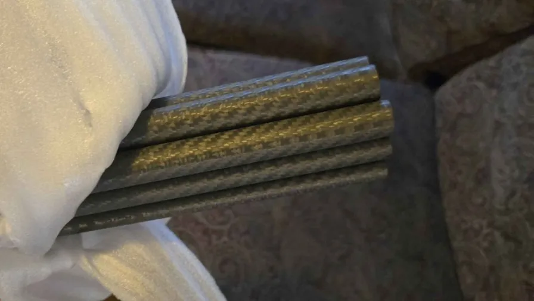

# Ordering Custom Carbon

Over the winter of 2024-2025, I vetted a supplier via Alibaba for carbon fiber tubes. The supplier has so far been delivering a very consistent product and in a pretty timely manner after orders are placed. They are also super easy to work with. You can order from them directly or order through me.

<figure><figcaption>
A bundle of 16mm*12mm*2000mm Carbon Fiber Tubes.
</figcaption></figure>


NOTE: I can't make any guarantees about the product, but it's been performing well so far and it's hard to argue with the price.


The supplier: [dzhuikai.en.alibaba.com](https://dzhuikai.en.alibaba.com/)

### Need to Know:

* tubes are: roll wrapped, 3k twill finish, polished, not painted
* all measurements need to be in millimeters
* tubes are designated OD\*ID\*Length
  * OD=outer diameter
  * ID=inner diameter
* can be up to 2.5 meters long
* can be connected to make longer tubes
  * connection should be closer to pommel than tip

If you want to save money ordering them directly from the supplier and don't _need_ longer tubes, you can order them at shorter lengths (<= 1.2 meters) and not have the $45 over-length fee. This can make a big difference. It'd be cheaper to order two 3.9ft tubes than one 8.2ft tube, for example.

Tubes cost about their OD in dollars at 2000mm and $4 more at 2500mm (Ex: 16mm\*12mm, $16 @ 2000mm, $20 @ 2500mm). They may quote you differently, but I don't expect them to.\
\
Then you add freight/shipping, which can range from $50-$290 for a single shipment, depending on size and the current market. I have had larger orders have to come in multiple shipments. Alibaba's policy is that the buyer must arrange freight, but many sellers offer this as part of the purchase and this supplier is one of them. I have never had an issue with my orders arriving late or damaged.

The final expense comes with the recent addition of customs charges due to tariffs. This is something to consider when placing your order, but has not been as problematic of a hurdle as it would seem, due to the already-low cost of the product. Discuss this with the supplier before getting discouraged. \
\
Different shipping providers will charge duties/tariffs in different ways. FedEx will want you to have an account with them, while UPS will allow you to pay them without one from the tracking page. I've asked the supplier to use UPS whenever possible. They also use SF Express as a freight provider, which may look weird and have a confusing tracking site to the uninitiated, but has also been reliable and caused me no issues. FedEx has been the only provider that has been a problem, with the customs charges going to the supplier, for which I reimbursed them directly.

### How To Place An Order

#### From the Supplier

Go to the [supplier's page](https://dzhuikai.en.alibaba.com/) on Alibaba, then click "Contacts" in the menu bar. On the page that opens, on the right, click "Send Inquiry"; this will open a new tab. In that new tab, tell them where you are located in the US, and how many tubes of each size you would like to order. You can also ask for sizes other than what I have shared, here, and at whatever length (under 2.5 meters) that you'd like. Request polished, but unpainted, for a matte finish that is more amenable to adhesives.

#### From Me

You can also order from me, which can be less expensive for small orders. I factor in shipping and costs per tube to set my prices. You can reach me for carbon orders via the Discord links in the sidebar, or by emailing inquiries.carbon@whackerdashery.com.

