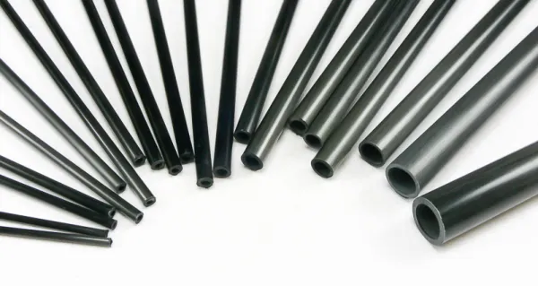

# Carbon Fiber Tubes

###

<figure><figcaption>
Assorted Carbon Tubes
</figcaption></figure>

1/2" tubes are sufficient for max blues and min-reds, but there are also multiple variants of .6"-.7" tubes with different inner diameters (with thicker walls making for stronger and heavier tubes) that can be used for longer weapons and increased strength.&#x20;

### Wrapped Tubes

<figure><figcaption>
A spiral wrapped carbon tube
</figcaption></figure>

Carbon tubes with further carbon or fiberglass reinforcement. These wraps are generally either a spiral wrap, braid, or twill pattern. Wrapped carbon tubes can often end up just slightly thicker than their designated size due to the wrap, and 1/2" options may have an outer diameter of closer to .6" depending on the thickness of the wrap, or because the vendor has them labeled by inner diameter. Different wraps produce different results, pay attention to the product descriptions on vendor sites.

### Sources

<table data-header-hidden><thead><tr><th width="315">Name</th><th width="154" align="center">Source</th><th>Link</th></tr></thead><tbody><tr><td>1/2" Carbon Tubes</td><td align="center">Fly Market Kites</td><td><a href="https://www.flymarketkites.com/pultruded-carbon-tubes/500-pultruded-carbon-tube">https://www.flymarketkites.com/pultruded-carbon-tubes/500-pultruded-carbon-tube</a></td></tr><tr><td>1/2" Carbon Tubes (24"-60") .500" Pultruded Carbon Tube</td><td align="center">Goodwinds*</td><td><a href="https://goodwinds.com/product-category/carbon-fiberglass/carbon/pultruded-tubes/">https://goodwinds.com/product-category/carbon-fiberglass/carbon/pultruded-tubes/</a></td></tr><tr><td>1/2" Wrapped Carbon Tube (60") WCT .500" - Standard Modulus</td><td align="center">Goodwinds*</td><td><a href="https://goodwinds.com/product/wct-500-x-60-wrapped-carbon-tube/">https://goodwinds.com/product/wct-500-x-60-wrapped-carbon-tube/</a></td></tr><tr><td>1/2" Wrapped Carbon Tube (60") WCT .500" - Intermediate Modulus</td><td align="center">Goodwinds*</td><td><a href="https://goodwinds.com/product/wct-500-x-60-wrapped-im-carbon-tube/">https://goodwinds.com/product/wct-500-x-60-wrapped-im-carbon-tube/</a></td></tr><tr><td>1/2" Wrapped Carbon Tube (60") WCT .500" - Twill</td><td align="center">Goodwinds*</td><td><a href="https://goodwinds.com/product/wct-500-x-60-wrapped-twill-carbon-tube/">https://goodwinds.com/product/wct-500-x-60-wrapped-twill-carbon-tube/</a></td></tr><tr><td>Various (58"-92.5")</td><td align="center">Gorg The Blacksmith</td><td><a href="https://www.gorgtech.com/shop/weapon-core-only/">https://www.gorgtech.com/shop/weapon-core-only/</a></td></tr><tr><td>0.625″ X 0.741″ Standard Modulus Carbon Fiber Tube (36"-96")</td><td align="center">Clearwater Composites</td><td><a href="https://www.clearwatercomposites.com/product/5-8-x-0-741-carbon-fiber-tube/">https://www.clearwatercomposites.com/product/5-8-x-0-741-carbon-fiber-tube/</a></td></tr><tr><td>3/8″ X 1/2″ Standard Modulus Carbon Fiber Tube (36"-96")</td><td align="center">Clearwater Composites</td><td><a href="https://www.clearwatercomposites.com/product/3-8-x-1-2-carbon-fiber-tube/">https://www.clearwatercomposites.com/product/3-8-x-1-2-carbon-fiber-tube/</a></td></tr><tr><td>1/2″ X 5/8″ Standard Modulus Carbon Fiber Tube (36"-96")</td><td align="center">Clearwater Composites</td><td><a href="https://www.clearwatercomposites.com/product/1-2-x-5-8-carbon-fiber-tube/">https://www.clearwatercomposites.com/product/1-2-x-5-8-carbon-fiber-tube/</a></td></tr></tbody></table>

***

##
