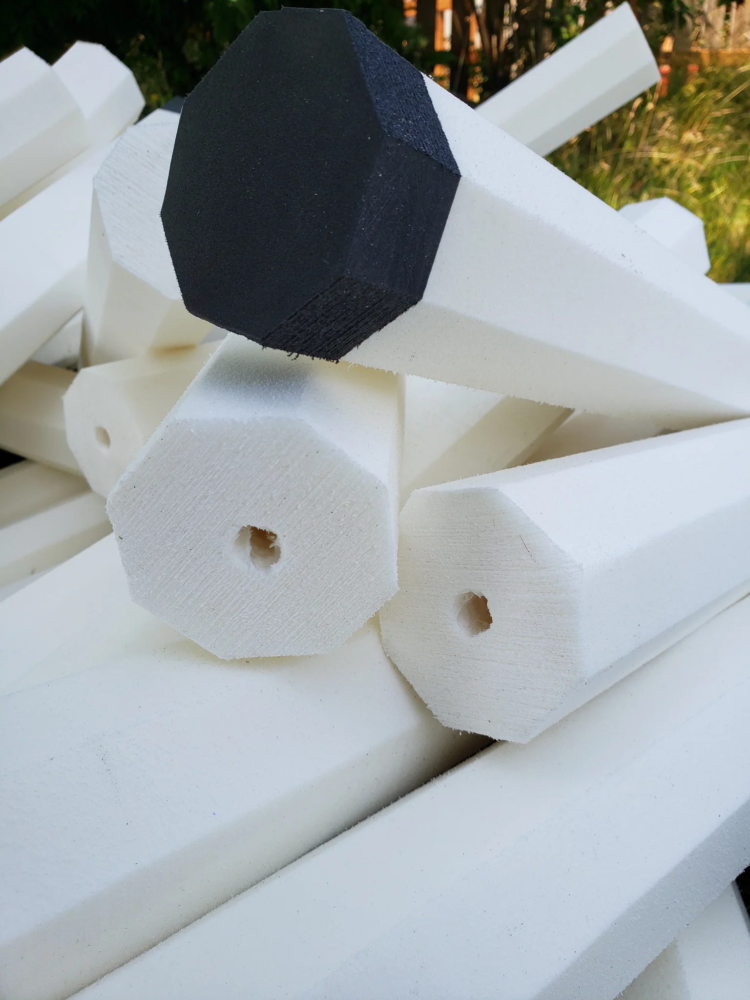

# Foam

## Overview

Foam, rightly so, is the primary material that we use to create implements for foam fighting sports. It is also a space where there can be a large amount of confusion over what is best, which often has foamsmiths reaching for subpar materials because those are the only ones they understand.\
\
Below are breakdowns of many commonly used foams, as well as some niche options that can be found if you know where to look that offer significantly better results. Rather than making you sift through all of that if you are just looking for quick recommendations, here is a table of each use case and the foams I would recommend, in order:

<table><thead><tr><th width="141">Use Case</th><th width="430">Recommended Foam(s)</th><th>Other Options</th></tr></thead><tbody><tr><td>Striking Surface</td><td><ul><li><a data-mention href="./#tubes-and-fries">#tubes-and-fries</a></li><li><a data-mention href="./#id-2lb-minicel-l-xlpe-cross-linked-polyethylene">#id-2lb-minicel-l-xlpe-cross-linked-polyethylene</a></li><li><a data-mention href="./#volara">#volara</a></li></ul></td><td><a data-mention href="./#id-2lb-closed-cell-polyethylene-foam">#id-2lb-closed-cell-polyethylene-foam</a></td></tr><tr><td>Pommel</td><td><ul><li><a data-mention href="./#id-4lb-closed-cell-cross-linked-polyethylene-foam">#id-4lb-closed-cell-cross-linked-polyethylene-foam</a></li><li><a data-mention href="./#firm-eva-foam">#firm-eva-foam</a></li></ul></td><td><a data-mention href="./#id-2lb-closed-cell-polyethylene-foam">#id-2lb-closed-cell-polyethylene-foam</a></td></tr><tr><td>Guard/Crosspiece</td><td><ul><li><a data-mention href="./#id-4lb-closed-cell-cross-linked-polyethylene-foam">#id-4lb-closed-cell-cross-linked-polyethylene-foam</a></li><li><a data-mention href="./#firm-eva-foam">#firm-eva-foam</a></li></ul></td><td><a data-mention href="./#id-2lb-closed-cell-polyethylene-foam">#id-2lb-closed-cell-polyethylene-foam</a></td></tr><tr><td>Box  (foam against core)</td><td><ul><li><a data-mention href="./#id-4lb-closed-cell-cross-linked-polyethylene-foam">#id-4lb-closed-cell-cross-linked-polyethylene-foam</a></li><li><a data-mention href="./#firm-eva-foam">#firm-eva-foam</a></li></ul></td><td><a data-mention href="./#id-2lb-closed-cell-polyethylene-foam">#id-2lb-closed-cell-polyethylene-foam</a></td></tr><tr><td>Stab Tip</td><td><ul><li><a data-mention href="./#nbr-acrylonitrile-butadiene-rubber-foam">#nbr-acrylonitrile-butadiene-rubber-foam</a></li><li><a data-mention href="./#ensolite">#ensolite</a></li></ul></td><td><a data-mention href="./#soft-eva-foam">#soft-eva-foam</a></td></tr><tr><td>Rocks</td><td><ul><li><a data-mention href="./#id-1lb-3lb-open-cell-foam">#id-1lb-3lb-open-cell-foam</a></li></ul></td><td>Shredded 2lb Foam Scraps</td></tr><tr><td>Shields</td><td><ul><li><a data-mention href="./#shield-blanks">#shield-blanks</a></li><li><a data-mention href="./#id-2.3lb-polyethylene-foam">#id-2.3lb-polyethylene-foam</a></li></ul></td><td><ul><li><a data-mention href="./#id-2lb-closed-cell-polyethylene-foam">#id-2lb-closed-cell-polyethylene-foam</a></li><li><a data-mention href="./#id-4lb-closed-cell-cross-linked-polyethylene-foam">#id-4lb-closed-cell-cross-linked-polyethylene-foam</a></li><li><a data-mention href="./#firm-eva-foam">#firm-eva-foam</a></li></ul></td></tr></tbody></table>

## Tubes & Fries

<figure><figcaption>
SLA'r Noodle (Tube)
</figcaption></figure>

| Use Case         | Grade   |
| ---------------- | ------- |
| Striking Surface | Amazing |

By far the easiest way to build a reliable weapon. Fries come in two halves or in one big piece that folds each half together to form a blade, only requiring glue in the center, with all other layers pre-glued or heat-adhered (a stronger, lighter, bond). Tubes come with all layers pre-glued or heat-adhered and will either have a hole down the center (tubes) or a routed channel sized to fit an appropriate core that is also rounded to give optimal surface contact for the glue-up. Depending on the source, tubes may be round or octagonal, whereas fries are generally flat blades, but can also come as what are essentially tubes cut down the middle. \
\
Tubes and fries come in a variety of foams and weights, with some fries even having multiple types of foam in them, generally 4lb boxes under 2lb striking surface foam. This will vary from vendor to vendor and most vendors will not tell you the exact kinds of foam that they use for one thing or another.&#x20;

### Sources

<table data-header-hidden><thead><tr><th width="237">Name</th><th width="132" align="center">Source</th><th>Link</th></tr></thead><tbody><tr><td>SLA'r Noodle (Tube)*</td><td align="center">Silver Lining Armory</td><td><a href="https://silverliningarmory.com/collections/frontpage/products/slar-noddle">https://silverliningarmory.com/collections/frontpage/products/slar-noddle</a></td></tr><tr><td>Assorted Tubes &#x26; Fries</td><td align="center">Cold Mountain Company</td><td><a href="https://www.etsy.com/shop/ColdMountainCompany?section_id=42685146">https://www.etsy.com/shop/ColdMountainCompany?section_id=42685146</a></td></tr></tbody></table>
