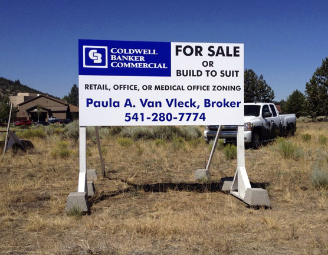

# Corrugated Plastic (Stub)

<figure><figcaption>
Assorted 4 mil coroplast sheets.
</figcaption></figure>

Content

<figure><figcaption>
4mil coroplast compared to 10mil.
</figcaption></figure>

### Yard Signs

<figure><figcaption>
A render of a 4mil coroplast sign.
</figcaption></figure>

Content

### Realty Signs

<figure><figcaption>
A large 10mil coroplast sign.
</figcaption></figure>

Content

### Sources

<table><thead><tr><th width="170">Material</th><th width="191">Source</th><th>Link</th></tr></thead><tbody><tr><td></td><td></td><td></td></tr></tbody></table>

***

