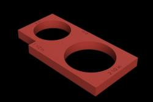
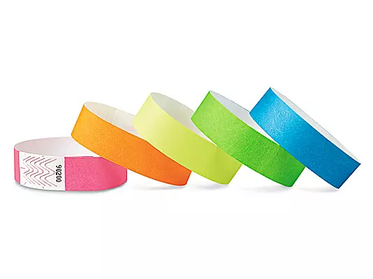

# Weapon Checking

## Overview

Weapons check is an essential part of foam fighting sports, as it is the primary means for mitigating risk and ensuring the safety of participants. It takes a number of tools to do completely and properly, and requires more still when weapons need marked as pass/fail for events.\
\
Here is an in-depth video guide to checking weapons:



***

## Tools

### Belegarth Weapon Checking Template

<figure><figcaption>
A 3D Render of the standard Belegarth Check Template
</figcaption></figure>

A 1/2" thick\* rectangle with a 2" hole, 2.5" hole, and a slot cut near one corner. The rectangle is 6" long on the longer side. The holes are used to check protrusions, pommels, and the tips of weapons. The slot in the corner is used to check armor thickness. The 6" side is used to measure the length of flail chains.

\*_Some templates are made from material that is not 1/2" thick. These should not be used to check for protrusions, as the rule for the check to fail a weapon relies on the protrusion, tip, or pommel reaching more than 1/2" through the relevant opening._

### Sources

<table data-header-hidden><thead><tr><th width="266">Source</th><th>Link</th></tr></thead><tbody><tr><td>Thingiverse (3D Model, .STL)</td><td><a href="https://www.thingiverse.com/thing:2929545">https://www.thingiverse.com/thing:2929545</a></td></tr><tr><td>Gorg The Blacksmith</td><td><a href="https://www.gorgtech.com/shop/weapons-checker-card/">https://www.gorgtech.com/shop/weapons-checker-card/</a></td></tr></tbody></table>

***

### A Penny

<figure><figcaption>
A front and back view of a penny.
</figcaption></figure>

Used to check metal armor against the "penny round" rule in the Book of War.&#x20;

***

### 48" Ruler

<figure><figcaption>
A 48" aluminum ruler.
</figcaption></figure>

A 48" ruler set on/taped to a table is the quickest way to triage weapons under 24" to not bother weighing them, to sort max-blues from min-reds before their weight check, and to confirm that arrows cannot be drawn more than 28" thanks to either the arrow head or a draw stop coming into contact with the body of the bow.

### Sources

<table data-header-hidden><thead><tr><th width="266">Source</th><th>Link</th></tr></thead><tbody><tr><td>Home Depot</td><td><a href="https://www.homedepot.com/p/Empire-48-in-Aluminum-Straight-Edge-Ruler-4004/100118266">https://www.homedepot.com/p/Empire-48-in-Aluminum-Straight-Edge-Ruler-4004/100118266</a></td></tr></tbody></table>

***

### Tape Measures

<figure><figcaption>
A standard 25' locking tape measure.
</figcaption></figure>

Having a long metal tape measure is the best way to quickly and accurately measure the distance for setting up projectile testing.&#x20;

<figure><figcaption>
A standard fabric tape measure.
</figcaption></figure>

Fabric tape measures, both with a housing/coil and without, are ideal for measuring the circumference of things like flail heads.

Both can also be used in lieu of a rigid 48" ruler and are suitable for measuring the length of a flail chain in a pinch.

### Sources

<table data-header-hidden><thead><tr><th width="266">Source</th><th>Link</th></tr></thead><tbody><tr><td>Amazon (25ft Locking Tape Measure)</td><td><a href="https://www.amazon.com/Komelon-SL2825IE-25ft-Self-Measure/dp/B0016A72F4/ref=asc_df_B0016A72F4">https://www.amazon.com/Komelon-SL2825IE-25ft-Self-Measure/dp/B0016A72F4/ref=asc_df_B0016A72F4</a></td></tr><tr><td>Amazon (60" Retractable Fabric Tape Measure)</td><td><a href="https://www.amazon.com/Measure-Measuring-Retractable-Double-Sided-BUSHIBU/dp/B077Z3R1JF/ref=sr_1_4">https://www.amazon.com/Measure-Measuring-Retractable-Double-Sided-BUSHIBU/dp/B077Z3R1JF/ref=sr_1_4</a></td></tr></tbody></table>

***

### Scale

<figure><figcaption>
A basic digital kitchen scale.
</figcaption></figure>

Used to make sure that weapons are adhering to minimum weight rules. Should ideally digital to rule out ambiguity, but doesn't need to be more accurate than to 10ths of an ounce unless you are trying to over-engineer cutting mass as much as possible. Having multiple scales, as well as non-digital scales, is helpful as backups and for keeping larger weapons check lines moving at a decent pace. A larger scale will be easier to balance weapons on.

### Sources

<table data-header-hidden><thead><tr><th width="266">Source</th><th>Link</th></tr></thead><tbody><tr><td>Amazon (Digital Kitchen Scale)</td><td><a href="https://www.amazon.com/AmazonBasics-Stainless-Digital-Batteries-Included/dp/B06X9NQ8GX/ref=sr_1_17">https://www.amazon.com/AmazonBasics-Stainless-Digital-Batteries-Included/dp/B06X9NQ8GX/ref=sr_1_17</a></td></tr><tr><td>Target (Digital Kitchen Scale)</td><td><a href="https://www.target.com/p/taylor-digital-kitchen-glass-top-11lb-food-scale-black/-/A-49178540">https://www.target.com/p/taylor-digital-kitchen-glass-top-11lb-food-scale-black/-/A-49178540</a></td></tr></tbody></table>

***

### Bow Draw-Weight Scale

<figure><figcaption>
A basic bow testing scale.
</figcaption></figure>

A proper bow draw-weight scale or even a fish scale is acceptable. Used specifically for testing bows to make sure they are drawing under 35lbs at a 28" draw length.&#x20;

### Sources

<table data-header-hidden><thead><tr><th width="266">Source</th><th>Link</th></tr></thead><tbody><tr><td>Amazon (Bow Tester)</td><td><a href="https://www.amazon.com/Multifunction-Portable-Handheld-Compound-ocs14/dp/B09TVVS6J9/ref=sr_1_3">https://www.amazon.com/Multifunction-Portable-Handheld-Compound-ocs14/dp/B09TVVS6J9/ref=sr_1_3</a></td></tr><tr><td>Walmart (Bow Tester)</td><td><a href="https://www.walmart.com/ip/Archery-Bow-Scale-Draw-Weight-Luggage-110lb-Compoundbow-Recurve-Peak-Hold-Weight/2583830272">https://www.walmart.com/ip/Archery-Bow-Scale-Draw-Weight-Luggage-110lb-Compoundbow-Recurve-Peak-Hold-Weight/2583830272</a></td></tr><tr><td>Amazon (Fish Scale)</td><td><a href="https://www.amazon.com/Fishfun-Digital-Hanging-Fishing-Compound/dp/B072SVHZLC/ref=asc_df_B072SVHZLC">https://www.amazon.com/Fishfun-Digital-Hanging-Fishing-Compound/dp/B072SVHZLC/ref=asc_df_B072SVHZLC</a></td></tr></tbody></table>

***

### Pass Stickers/Bands

<figure><figcaption>
Assorted tyvec wrist bands.
</figcaption></figure>

Should be a semi-unique sticker or colored disposable wrist bands. If the latter, it is a good idea to prepare the bandoliers of wrist bands by cutting them in half so they are shorter and easier to apply while also not having excess, as hilts have a much smaller diameter than wrists. For multi-day events, the stickers/bands should be different each day if possible.

### Sources

<table data-header-hidden><thead><tr><th width="266">Source</th><th>Link</th></tr></thead><tbody><tr><td>Amazon (Disposable Neon  Wrist Bands)</td><td><a href="https://www.amazon.com/Wristbands-Waterproof-Bracelets-Adjustable-Identification/dp/B0D9JHVCWN/ref=sr_1_2_sspa">https://www.amazon.com/Wristbands-Waterproof-Bracelets-Adjustable-Identification/dp/B0D9JHVCWN/ref=sr_1_2_sspa</a></td></tr><tr><td>Amazon (Disposable Checkered Wrist Bands)</td><td><a href="https://www.amazon.com/WristCo-Black-Checkered-Checks-Wristbands/dp/B01MV1SO4K/ref=sr_1_8">https://www.amazon.com/WristCo-Black-Checkered-Checks-Wristbands/dp/B01MV1SO4K/ref=sr_1_8</a></td></tr></tbody></table>

***

### Fail Stickers/Tape

<figure><figcaption>
A roll of blank name tag labels.
</figcaption></figure>

Rather than plain stickers, fail stickers should be large and easy to write on so that the reason the weapon failed can be written on it \*before\* it is applied to the weapon. If possible, a piece of highly-visible and easy-to-remove tape should be placed on the offending region if the weapon is failing for a defect rather than things that can be concisely communicated on the fail sticker like hit/template/etc.

### Sources

<table data-header-hidden><thead><tr><th width="266">Source</th><th>Link</th></tr></thead><tbody><tr><td>
Amazon

(Blank Labels)
</td><td><a href="https://www.amazon.com/LotFancy-Stickers%EF%BC%8C3-5-Labels-Adhesive-Perforated/dp/B08R9DWCVM/ref=sr_1_13_sspa">https://www.amazon.com/LotFancy-Stickers%EF%BC%8C3-5-Labels-Adhesive-Perforated/dp/B08R9DWCVM/ref=sr_1_13_sspa</a></td></tr><tr><td>Amazon (Blue Painter's Tape)</td><td><a href="https://www.amazon.com/Painters-Painting-Adhesive-Decoration-Labeling/dp/B0BPS5QB4D/ref=sr_1_7">https://www.amazon.com/Painters-Painting-Adhesive-Decoration-Labeling/dp/B0BPS5QB4D/ref=sr_1_7</a></td></tr></tbody></table>
