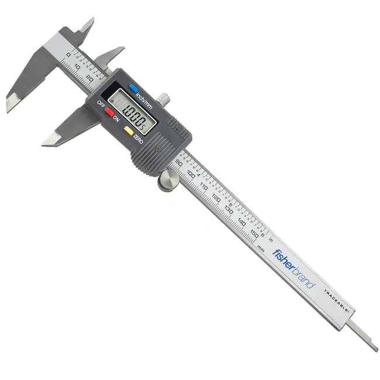
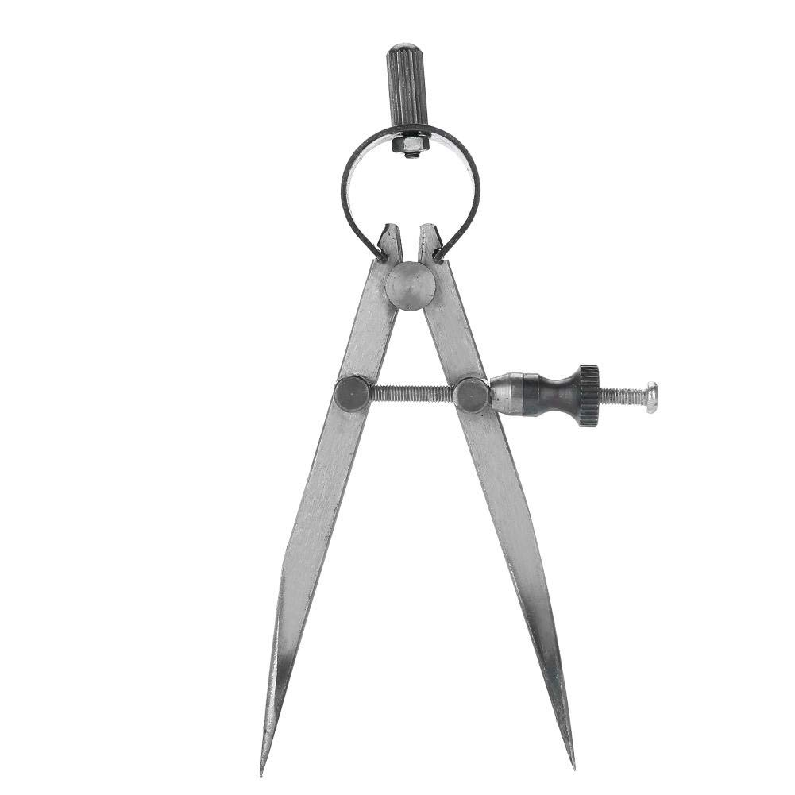
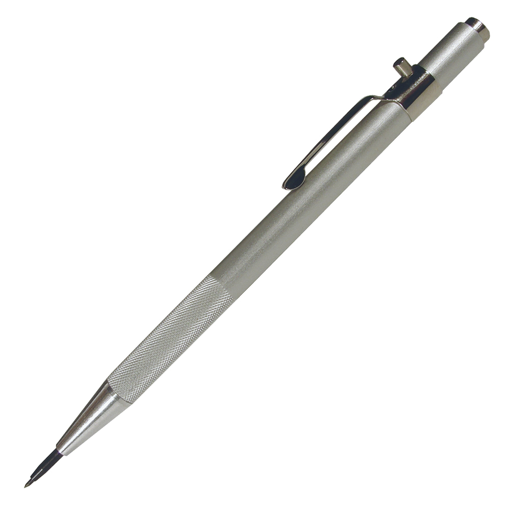
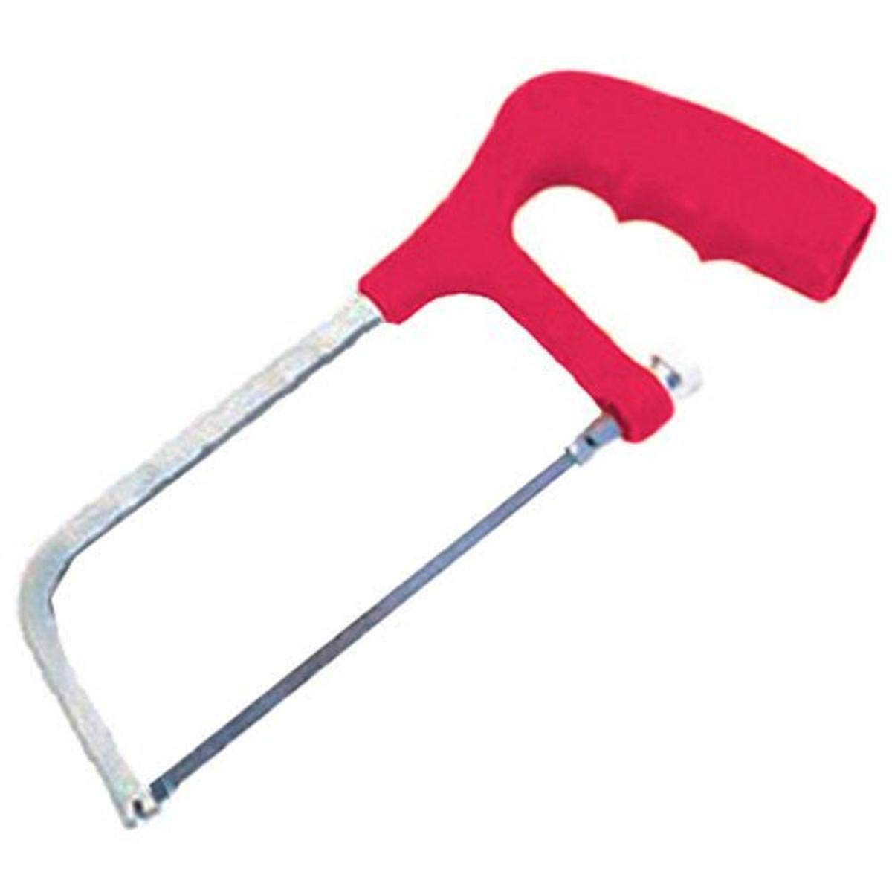

# Hand Tools

## Overview

This page highlights the strengths of each of these tools, but does not link any sources. Each of these should be readily findable at any large in-person tool vendor, at big box stores like Walmart, Lowes, or Home Depot, and at online retailers such as Amazon.

***

## Measuring Tools

### Ruler & Straight Edge

<figure><figcaption>
A 48" aluminum ruler.
</figcaption></figure>

Being able to measure and mark straight lines, as well as use the metal straight edge as a cutting fence/guide, will make your builds much cleaner and, by extension, likely more durable and lighter, as your cuts will make adhering foam together much easier and make for more-secure connections with less adhesive.

***

### Tape Measures

<figure><figcaption>
A standard 25' locking tape measure.
</figcaption></figure>

 

<figure><figcaption>
A standard fabric tape measure.
</figcaption></figure>

Tape measures are a bit easier to wield than a large ruler, and fabric tape measures allow for easily measuring the diameter or contour of an object.

***

### Speed Square

<figure><figcaption>
A standard 6" speed square.
</figcaption></figure>

Speed squares have many uses, though the most notable for common use is being able to reliably get 45 and 90 degree angles off of a given flat surface. [This video](https://www.youtube.com/watch?v=BBJHQNR05xo) from Make Build Modify is a great breakdown of the more-advanced uses if you are curious, but you will not need to know them for general foamsmithing applications.

***

### Drafting Triangles

<figure><figcaption>
A set of drafting triangles. Left, 45-45-90; Right, 30-60-90.
</figcaption></figure>

A great supplement for a speed square, often times coming in handy specifically for not having the fence on one side that resigns it to only being used on the edge of something. Great straight edges for shorter spans where a large ruler would be cumbersome, and excellent tools for drafting common angles.

***

### Calipers

<figure><figcaption>
Basic electronic calipers.
</figcaption></figure>

If you want to know the thickness of something, the distance between two points/surfaces, or the depth of a hole/etc., to a high degree of accuracy and precision, digital calipers are the absolute best tool for the job. Beware, they tend to drain their batteries while off, and both the battery and the battery cover can be easy to misplace; it is always recommended to put calipers away in a case with the battery removed between uses.

***

### Compass Calipers

<figure><figcaption>
Basic compass calipers.
</figcaption></figure>

If you simply need to mirror or compare distances without knowing exactly what they are, or need to draw accurate arcs/circles, compass calipers are the tool to use. They can be found both with and without rings for mounting pens/pencils/markers.

***

## Marking Tools

### Permanent Markers

<figure><figcaption>
A standard black Sharpie.
</figcaption></figure>

 

<figure><figcaption>
A standard metallic silver Sharpie.
</figcaption></figure>

Black Sharpie is by far the best general purpose marking tool for foamsmithing. A close second would be metallic silver Sharpies, which will make visible marks on dark surfaces upon which black Sharpies would be too dark to create good contrast. Other brands of permanent marker will work, as will non-permanent markers, though non-permanent markers may smudge or not be as visible on certain surfaces.

***

### Scribe

<figure><figcaption>
A basic carbide-tipped scribe.
</figcaption></figure>

Scribes draw lines by making scratches. This can sometimes be preferable to markers. Scribes like this also make great punches for soft materials like foam and can find themselves performing myriad non-marking tasks. Overall not a must have, just a nice to have.

***

## Cutting Tools

### Box Cutter

<figure><figcaption>
A basic box cutter.
</figcaption></figure>

Box cutters are OK for cutting foam, but are often overshadowed by better options.

***

### Exacto Knife/Scalpel

<figure><figcaption>
A standard exacto knife.
</figcaption></figure>

Exacto knives and scalpels are excellent for doing intricate cuts and carving with foam and for cutting corrugated plastic. If you already have a decent pairing knife or filet knife, you'll likely find that you'd rather use those instead for most things.

***

### Carving Bread Knife

<figure><figcaption>
A standard carving bread knife.
</figcaption></figure>

The most versatile cutting tool on this page. You could get away with this being the only foam-cutting knife in your kit. Great for doing long cuts against a straight edge, doing freeform cuts that stay straight by virtue of the long blade, carving foam, and even for removing foam from the core when it comes time to reblade a weapon.

***

### Filet Knife

<figure><figcaption>
A basic filet knife.
</figcaption></figure>

Excellent for carving foam and for making small, intricate, cuts. The long curved blade makes certain carving actions easier than they would be with a pairing knife.

***

### Pairing Knife

<figure><figcaption>
A basic pairing knife.
</figcaption></figure>

Excellent for carving foam and better able to handle stiffer foams than a filet knife, as well as being able to be more precise due to its small size.

***

### Serrated Steak Knife

<figure><figcaption>
A basic serrated steak knife.
</figcaption></figure>

An excellent secondary to the carving bread knife and pairing knife, for when the bread knife is overkill and potentially less nice for a particular task due to its size, or for when the pairing knife's non-serrated blade isn't handling a cut as well as a serrated blade would.

***

### Hack Saw

<figure><figcaption>
A basic hack saw.
</figcaption></figure>

Primarily targeted for cutting cores. Should be able to cut both solid and hollow cores, as well as PVC, with no issues. Also workable for cutting and carving foam, but I would avoid it and use better options whenever able.

***

### Large Flat Head Screwdriver

<figure><figcaption>
A 3/8" slot, 12" long, screwdriver.
</figcaption></figure>

Extremely helpful for punching holes in foam and coroplast. Is also a large help for feeding shield straps through their slots when assembling shields. Can be used to cut foam in a pinch, but understandably not very good for it.&#x20;

***

