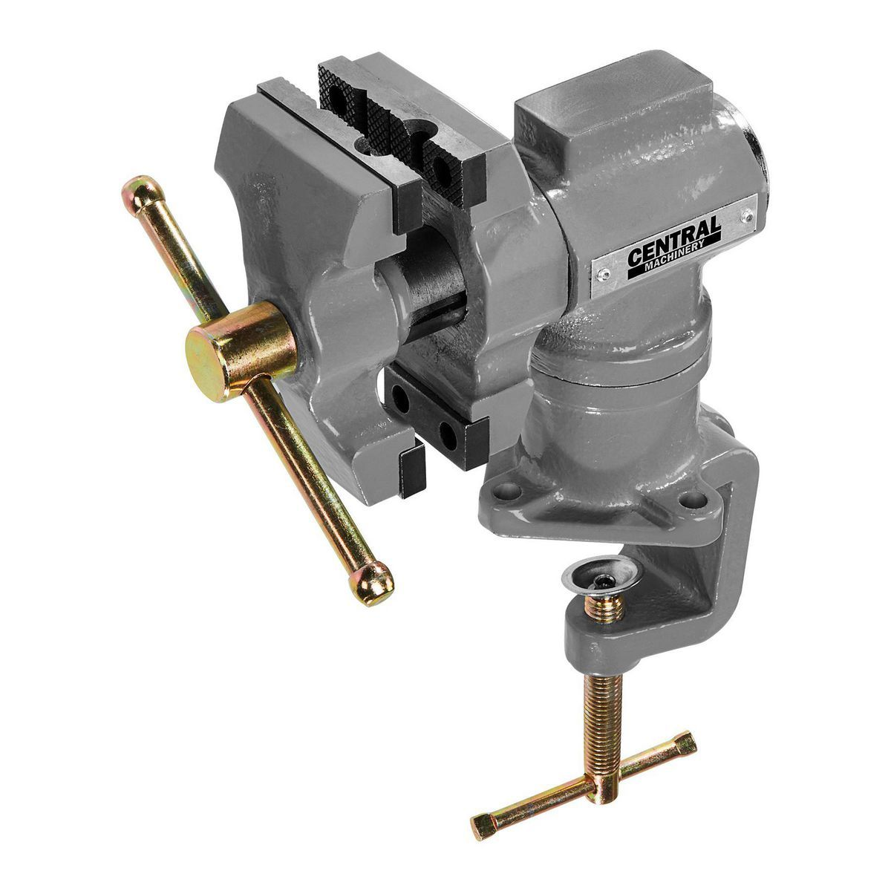
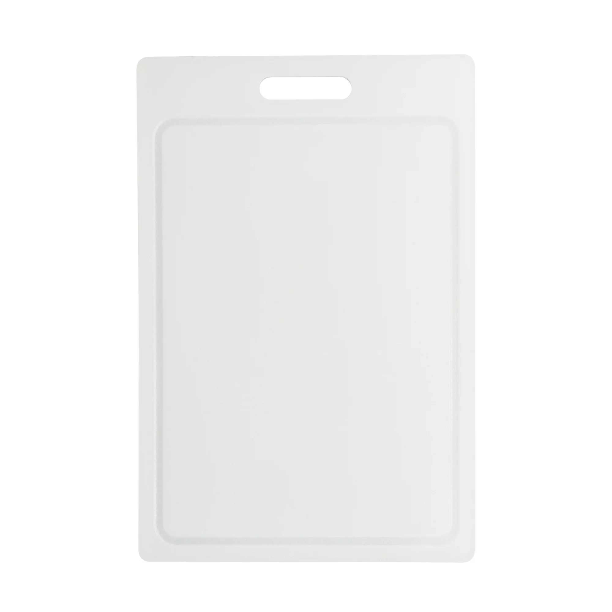
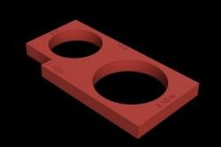

# Other

### Bench-Top Vise

<figure><figcaption>
A standard 2 1/2" Swivel Vise
</figcaption></figure>

A bench-top vise is incredibly useful for holding a weapon/core still while you are working on it. Clamping the handle in the vice allows you to much more easily apply tubes and fries, build box blades, install guards/crosspieces, stab tips, pommels, covers, and to do tape wraps. Unfortunately, as the only place to safely clamp to is often the handle itself, it is harder to take advantage of this for doing handle wraps.

### Sources/Examples

<table data-header-hidden><thead><tr><th width="229">Source</th><th>Link</th></tr></thead><tbody><tr><td>Amazon</td><td><a href="https://www.amazon.com/Universal-Electric-Grinder-Woodworking-Drilling/dp/B0BX7S4KT5">https://www.amazon.com/Universal-Electric-Grinder-Woodworking-Drilling/dp/B0BX7S4KT5</a></td></tr><tr><td>Harbor Freight</td><td><a href="https://www.harborfreight.com/2-12-in-table-swivel-vise-59113.html">https://www.harborfreight.com/2-12-in-table-swivel-vise-59113.html</a></td></tr></tbody></table>

***

### Cutting Board

<figure><figcaption>
A standard cutting board
</figcaption></figure>

A must-have for doing repairs and cutting foam with hand tools. Being able to cut against a cutting board will protect the surface that you are using to support your cut, and will also allow you to make cleaner cuts when you otherwise wouldn't have been able to from doing them free-hand, etc. Cutting boards come in many sizes; in this instance, the larger (within reason) the better.

### Sources/Examples

<table data-header-hidden><thead><tr><th width="229">Source</th><th>Link</th></tr></thead><tbody><tr><td>Amazon</td><td><a href="https://www.amazon.com/Farberware-Plastic-Cutting-Groove-15x20-Inch/dp/B09BG7YYCW">https://www.amazon.com/Farberware-Plastic-Cutting-Groove-15x20-Inch/dp/B09BG7YYCW</a></td></tr><tr><td>Walmart</td><td><a href="https://www.walmart.com/ip/Mainstays-Poly-12-x-18-Cutting-Board/13397991">https://www.walmart.com/ip/Mainstays-Poly-12-x-18-Cutting-Board/13397991</a></td></tr></tbody></table>

***

### Scale

<figure><figcaption>
A basic digital kitchen scale.
</figcaption></figure>

Used to make sure that weapons are adhering to minimum weight rules. Should ideally digital to rule out ambiguity, but doesn't need to be more accurate than to 10ths of an ounce unless you are trying to over-engineer cutting mass as much as possible. Having multiple scales, as well as non-digital scales, is helpful as backups and for keeping larger weapons check lines moving at a decent pace. A larger scale will be easier to balance weapons on.

### Sources/Examples

<table data-header-hidden><thead><tr><th width="266">Source</th><th>Link</th></tr></thead><tbody><tr><td>Amazon (Digital Kitchen Scale)</td><td><a href="https://www.amazon.com/AmazonBasics-Stainless-Digital-Batteries-Included/dp/B06X9NQ8GX/ref=sr_1_17">https://www.amazon.com/AmazonBasics-Stainless-Digital-Batteries-Included/dp/B06X9NQ8GX/ref=sr_1_17</a></td></tr><tr><td>Target (Digital Kitchen Scale)</td><td><a href="https://www.target.com/p/taylor-digital-kitchen-glass-top-11lb-food-scale-black/-/A-49178540">https://www.target.com/p/taylor-digital-kitchen-glass-top-11lb-food-scale-black/-/A-49178540</a></td></tr></tbody></table>

***

### Belegarth Weapon Checking Template

<figure><figcaption>
A 3D Render of the standard Belegarth Check Template
</figcaption></figure>

A 1/2" thick\* rectangle with a 2" hole, 2.5" hole, and a slot cut near one corner. The rectangle is 6" long on the longer side. The holes are used to check protrusions, pommels, and the tips of weapons. The slot in the corner is used to check armor thickness. The 6" side is used to measure the length of flail chains.

\*_Some templates are made from material that is not 1/2" thick. These should not be used to check for protrusions, as the rule for the check to fail a weapon relies on the protrusion, tip, or pommel reaching more than 1/2" through the relevant opening._

### Sources/Examples

<table data-header-hidden><thead><tr><th width="266">Source</th><th>Link</th></tr></thead><tbody><tr><td>Thingiverse (3D Model, .STL)</td><td><a href="https://www.thingiverse.com/thing:2929545">https://www.thingiverse.com/thing:2929545</a></td></tr><tr><td>Gorg The Blacksmith</td><td><a href="https://www.gorgtech.com/shop/weapons-checker-card/">https://www.gorgtech.com/shop/weapons-checker-card/</a></td></tr></tbody></table>

***

### Clamps

There are a myriad different varieties of clamps. From holding cores to work surfaces, to holding the ends of handle wraps, to securing jigs to tables, or holding straight edges in place to act as a fence for making a mark or a cut, clamps clamps can make many tasks much easier that it would be without them. Below are a few of the kinds that are most helpful for foamsmithing purposes.&#x20;

#### Spring Clamps

<figure><figcaption>
A generic spring clamp.
</figcaption></figure>

Very easy to use and quick to apply and remove, but limited in how wide they can open. Large options that can open very wide exist, but they are also relatively cumbersome at that point. Great for clamping straight edges to foam sheets, cutting boards, and tables, for clamping cutting boards to tables, and securing just about anything you can fit in the jaws. The pinching action and shape of the portion that comes into contact with the objects being clamped is also much more forgiving than that of other kinds of clamps. 1", 3", and 6" are helpful sizes to have a few of, each, on hand.

#### Quick Clamps

<figure><figcaption>
A high quality quick clamp.
</figcaption></figure>

Can do almost all of the things a spring clamp can do, and many more it can't. Quickly change the size of the clamp and pump a squeeze handle to tighten it, making it easy to adjust these clamps with a single hand. While you don't need to buy the absolute top of the line, it would be a good idea to avoid the cheapest options, as they often have plastic parts in places under high stress that fail quickly, leading to the entire clamp falling apart, or just losing it's ability to clamp tightly, rendering it just as useless. These clamps are nice to have, but are generally more expensive than c clamps. 6" and 12" are good sizes to have a few of, each, on hand, but you may find that you want to get some that are even larger, depending on what you're doing.

#### C Clamps

<figure><figcaption>
A basic c clamp.
</figcaption></figure>

Capable of creating extremely tight clamping pressure event if you buy the cheap stuff thanks to them being as simple as they are and always made fully out of metal. Almost as versatile as a quick clamp, but limited by how long it can take to make large changes to the size of the clamp and the, much smaller, all-metal contact points. At the same time, the increased clamping ability and metal contact points do provide utility that both spring clamps and quick clamps cannot. 3" and 6" are helpful sizes to have a few of, each, on hand.&#x20;

### Sources

Any and all hardware/tool stores, Walmart, Amazon, et al.

***
