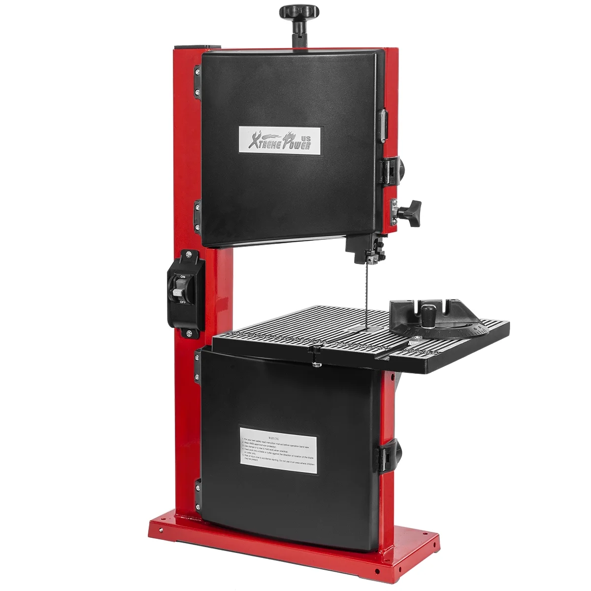
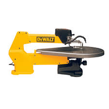
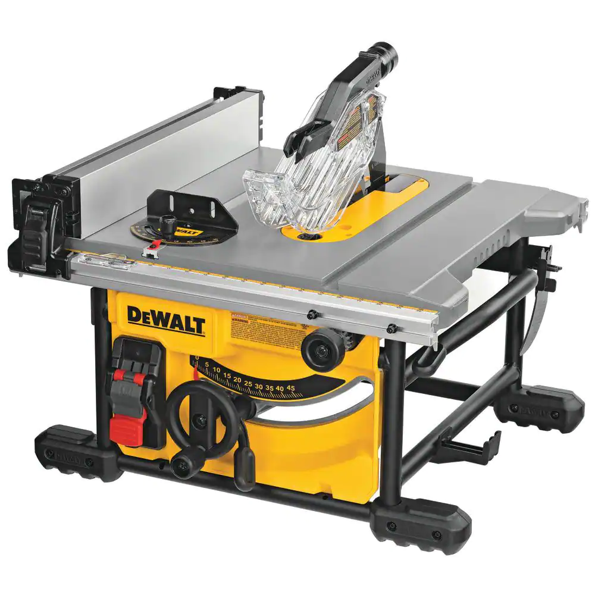
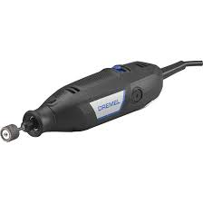
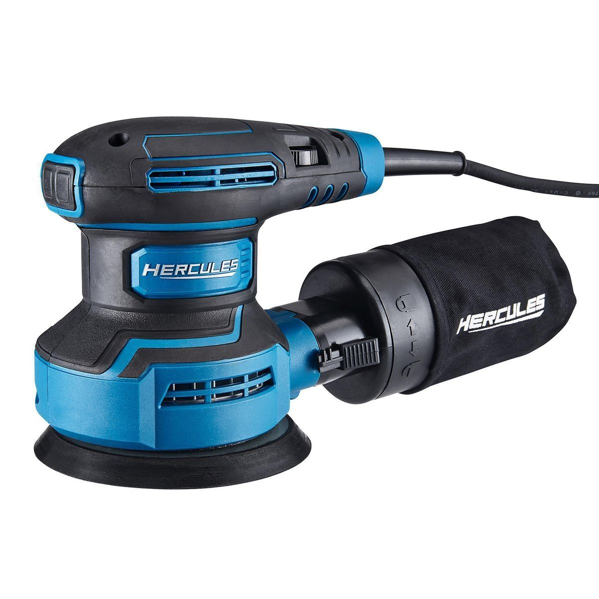
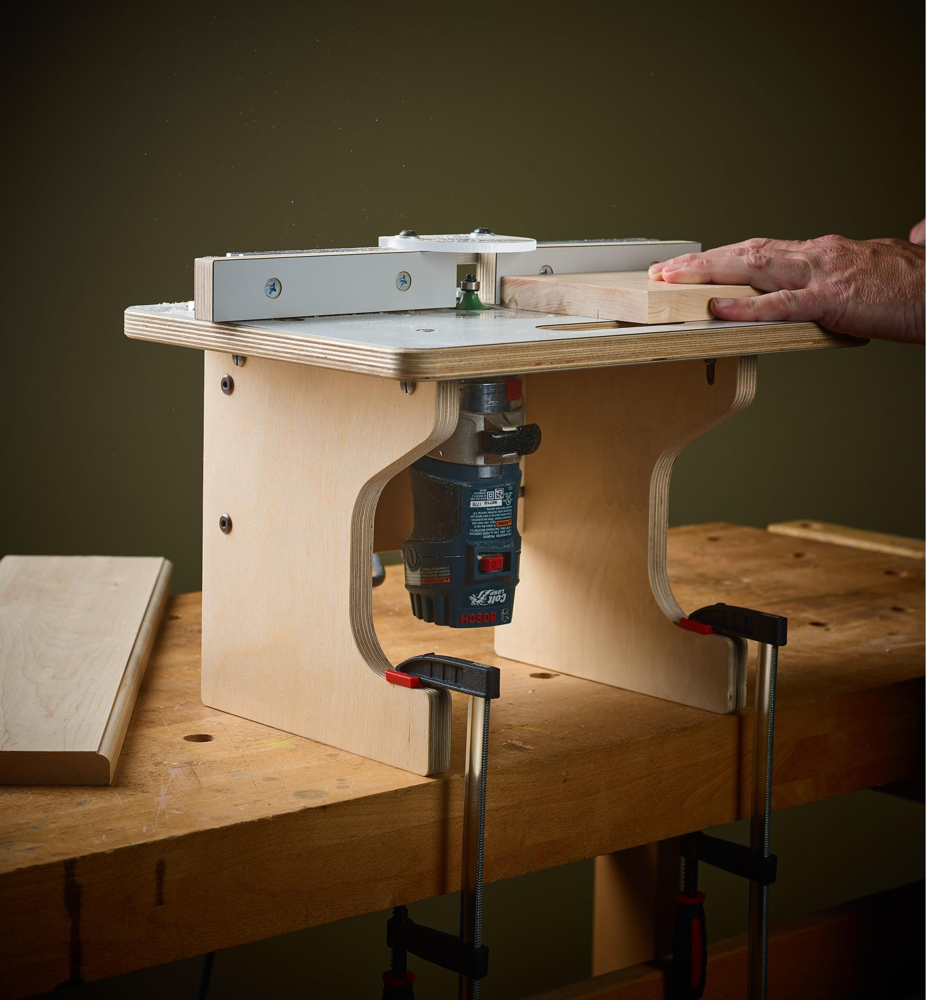
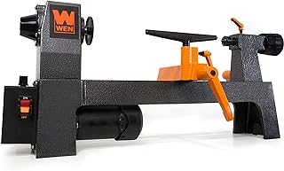
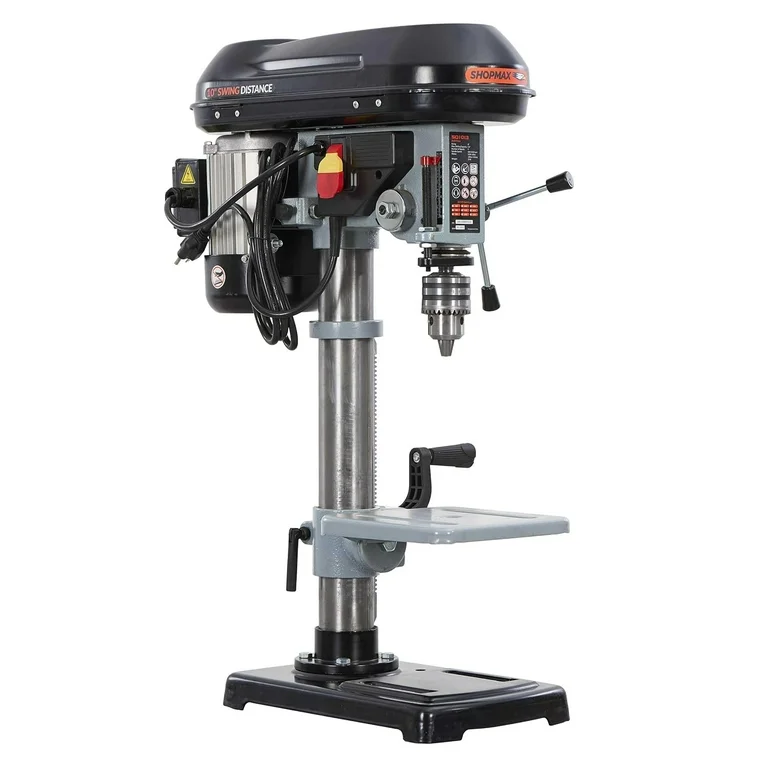

# Power Tools

## Overview

This page highlights the strengths of each of these tools, but does not link any sources. Because foam is so soft and easy to work with, one does not generally need to get the expensive versions of any tool; often, finding used, even vintage, power tools will see you with something that works more than well enough for the desired tasks. Each of these should be readily findable at any large in-person power tool vendor, on places such as Facebook marketplace, and online retailers like Amazon.

***

## Cutting Tools

### Band Saw

<figure><figcaption>
An inexpensive bench-top band saw.
</figcaption></figure>

Bench-top band saws can be found relatively affordably, both brand new and used, and are by far the best cutting tool for foamsmithing.&#x20;

An excellent tool for cutting foam, for straight cuts with or without a fence, tracing curves, and even doing mitered edges. If the cut fits inside the throat-depth (the distance between the exposed blade and the frame, i.e. the largest cut the saw can make), band saws can also be used to cut both solid and hollow fiberglass, carbon, and graphite cores. For both foam and cores, a sharp blade with finer teeth is going to give better results.

Also effective at stripping foam from old weapons that are being rebuilt, but the adhesive and scraps of foam will build up on the blade and rollers, which can cause the saw to no longer cut firmer materials, like plastic and wood, effectively. If you are comfortable resigning a band saw to only being for foam-work, this is not a concern.

***

### Scroll Saw

<figure><figcaption>
A basic scroll saw.
</figcaption></figure>

An excellent tool for intricate and complex cuts in foam, but largely not worth considering for foamsmithing, as you would be better or similarly served by a Band Saw 99% of the time.&#x20;

***

### Miter Saw

<figure><figcaption>
A basic miter saw.
</figcaption></figure>

An OK choice for cutting down solid fiberglass cores and for doing miter cuts on small pieces of foam when being used with proper hand positioning and safety measures. There are better choices for cutting cores and doing miter cuts, so using a miter saw for foamsmithing should only be borne out of not having one of those and already having a Miter Saw.

***

### Table Saw

<figure><figcaption>
A compact table saw.
</figcaption></figure>

Effective for cutting large sheets of foam down to smaller, more manageable sheets, though I would recommend doing this with a non-powered tool in most cases. Can also be used to cut solid fiberglass cores, though there are better options.

***

### Sawzall

<figure><figcaption>
A basic corded sawzall.
</figcaption></figure>

Only viable for stripping foam from cores; the easily removable blades are easy to clean and replace when they inevitably build up adhesive and foam on them, which can be detrimental other types of saw. Not worth using for anything else. Make sure weapon's handle is secured in a vise when using a sawzall to strip foam.

***

### Jig Saw

<figure><figcaption>
A basic jig saw.
</figcaption></figure>

An all around mediocre and ignorable choice for foamsmithing. It can be used effectively to cut foam, but you will have a better experience with more stable tools. It is also an effective foam stripping tool, and can be easier to handle than a sawzall thanks to being smaller.

***

## Grinding/Shaping Tools

### Bench-top Grinder

<figure><figcaption>
A basic bench-top grinder.
</figcaption></figure>

Can be used to shape foam and smooth/chamfer the ends of solid cores. The unit being mounted to a bench gives the foamsmith lots of flexibility when using this for foam carving, as it will remove lots of material at once and power through any adhesive layers.

***

### Angle Grinder

<figure><figcaption>
A basic angle grinder.
</figcaption></figure>

Angle grinders are inherently dangerous tools and shouldn't be handled by anyone without a decent amount of power tool experience and proper respect for the dangers present. They can be used similarly to benchtop grinders, but can also have cut-off wheels installed and be used to cut hollow cores.&#x20;

***

### Dremel

<figure><figcaption>
A basic corded dremel.
</figcaption></figure>

Dremels are essentially miniature angle grinders. They are good for quartering PVC and cutting/smoothing/chamfering cores of all kinds. They are also good for intricate carving of foam and plastidipped surfaces, as well as for cutting through handle-wraps and hard glue that are proving difficult to remove otherwise.&#x20;

***

### Benchtop Belt/Disc Sander

<figure><figcaption>
A basic bench-top belt/disc sander.
</figcaption></figure>

Can be used to shape foam and smooth/chamfer the ends of solid cores. Can also be used, if done carefully, to rough up the surface of cores and foam for better adhesion when gluing, though a palm sander or hand-sanding (and in the case of foam, scoring the surface instead of sanding) are better options.

***

### Palm Sander

<figure><figcaption>
A basic corded palm sander.
</figcaption></figure>

Can be used to smooth/chamfer the ends of solid cores and to roughen the surface of cores and foam for better adhesion.&#x20;

***

### Router

<figure><figcaption>
A small router, pictured mounted to a bench-top router table.
</figcaption></figure>

A router on its own is not particularly useful for foamsmithing. Routers mounted to router tables, with fences and jigs built to assist with putting channels in foam, are the best ways to prepare foam for building core-boxes and for making your own reblade fries and tubes. Palm routers are plenty powerful for foam carving needs. Putting rounded channels in foam to fit snugly against the core is the only real use for routers in foamsmithing.

***

### Lathe

<figure><figcaption>
An 8" bench-top lathe
</figcaption></figure>

In regards to foamsmithing, lathes have only niche uses. A lathe could be used for carving foam for pommels, for taking the ridges off a bolt being used in the pommel for a counter weight, and not for much else. It stands to reason that a lathe could be used to assist with cleaning a core after most of the foam from a previous build has been removed, but a large lathe would be needed for most cores to fit in them and be properly supported. Other tools are more readily available, less expensive, and more versatile.

***

### CNC

<figure><figcaption>
A small CNC router.
</figcaption></figure>

CNCs have a largely untapped potential in regards to Foamsmithing. Small CNC routers could be used to make intricate carvings for guards/crosspieces, pommels, and incidental padding, whereas larger format CNCs would be able to do the same and also be able to carve detailed surfaces for shields in single sheets of foam in a single pass. A perfect addition to the toolbox for anyone doing extensive plastidipping.

***

## Other

### Drill Press

<figure><figcaption>
A standard bench-top drill press.
</figcaption></figure>

Drill presses are not particularly useful for foamsmithing other than for things like boring holes when making pommels.

***

### Hand Drills

<figure><figcaption>
A standard cordless drill.
</figcaption></figure>

Hand drills, like drill presses, don't have many uses for foamsmithing. The only prominent use that couldn't be easily supplanted by other tools would be boring long holes in solid foam using auger bits so as to make your own tubes; this is plagued with angular accuracy issues and is also often better served by using a router table to carve two channels into separate pieces of foam and then joining them together so the channels form a round hole, or just using them as is and adhering them together as part of assembling the weapon.

***

### Heat Gun

<figure><figcaption>
A basic heat gun.
</figcaption></figure>

Can be used to heat PVC for easy bending and manipulation as well as to melt the surfaces of two pieces of foam to heat-adhere them together. Heat-adhesion is the strongest bond that you can create for foam-to-foam connections and doesn't use extra consumables nor does it add additional weight.

***

### Hot Glue Gun

<figure><figcaption>
A basic hot glue gun.
</figcaption></figure>

Hot glue is a rather effective foam-to-core adhesive, glue guns are the means to using hot glue. Glue sticks come in multiple sizes, and glue guns come in low, high, and dual temperature variants; be sure to get sticks that fit your glue gun. High temp glue guns are not necessary and don't provide a particular advantage for foamsmithing purposes, but a higher temp glue gun, or a dual temp glue gun set to high, will melt the glue stick faster and increase flow rate, which can be helpful for getting things done more quickly.

***
