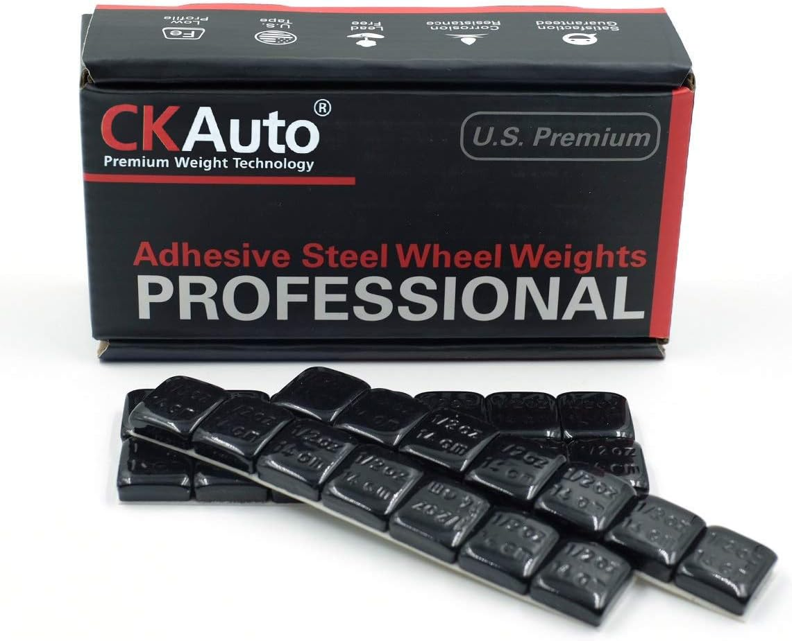

# 3"+ PVC Pipe

Large diameter PVC is a perfect storage and transport solution for pole-arms that don't have cross guards or other protrusions. A 3" PVC Pipe that has a solid cap on one end and a threaded cap on the other with a plug that can be threaded into it will protect the entire length of the weapon from rain, snow, sun, and physical damage. It won't protect it from heat, nor cold, and the weapon will mold if left in something like this across entire seasons, but this would largely enable you to have your pole-arms essentially have permanent homes attached to a roof rack on a vehicle, or at least make transporting them on top of a vehicle less worrisome.

<figure><figcaption>
An example of a PVC Pipe mounted to a vehicle.
</figcaption></figure>

Larger PVC tubes can be used when necessary, but the 3" variant is perfect for most modern javelins, spears, and glaives, as well as being more than enough for weapons under 4ft in length, as they are rarely wider than 2.75". It can easily be bought in a lightweight Schedule 30 variant for around $20 at 10 ft long, with heavier, but stronger, Schedule 40 around $13. Schedule 80 is not recommended both because of the increased price, not needing the extra strength, and because it is usually a darker material, which will mean your gear is getting even hotter when it's out in the sun.

For transporting multiple weapons at once, it can be more economical to use 8" PVC Sewer/Drain pipe, which should be able to fit 4 of anything that fits in the 3" pipe, with some room to breathe. 10' sections of 8' PVC can be had for around $70, which is already a moderate savings over the cost of getting 3" pipes for 4 pole-arms, increasing further once you consider the caps for the ends.

Not all caps are created equally. If you want a permanent cap that will be more guaranteed to stay on, get one with longer walls that will stay on better, or glue/screw it in place. I've not had any issues with friction fits on the tube I had on top of my car for 4-5 years straight, aside from one instance where the pole-arm created a seal while being inserted and the "permanent" cap was forced off the other end due to the pressure build up, which was only an issue because the tip had just been repaired and was still slightly oversize.

PVC can be easily cut with hand tools and should be cut with toothed metal blades instead of abrasive cutting tools, as the latter creates and kicks into the air a significantly larger amount of find particles, while saw blades primarily create larger chunks that immediately fall out of the air instead of suspending themselves in it and being an inhalation risk. You do not want to inhale PVC dust. Even when cutting with a saw, it is advised to wear good dust goggles and a dust mask.

For simplicity's sake, all of the below links are from a single store. Equivalents to each item can be found at nearly any large hardware store.

| 3"x10' Sch30 Thin Wall PVC Pipe        | 
<figure><figcaption></figcaption></figure>
  | Menards | [https://www.menards.com/main/plumbing/pipe-fittings/pvc-pipe-fittings/charlotte-pipe-and-foundry-3-x-10-thin-wall-dwv-sch-30-pvc-pipe/pvc093000600/p-1444426397401-c-8571.htm](https://www.menards.com/main/plumbing/pipe-fittings/pvc-pipe-fittings/charlotte-pipe-and-foundry-3-x-10-thin-wall-dwv-sch-30-pvc-pipe/pvc093000600/p-1444426397401-c-8571.htm?exp=false) |
| -------------------------------------- | --------------------------------------------------------------------------------------------------------- | ------- | ------------------------------------------------------------------------------------------------------------------------------------------------------------------------------------------------------------------------------------------------------------------------------------------------------------------------------------------------------------------------ |
| 3"x10' Sch40 PVC Pipe                  | 
<figure><figcaption></figcaption></figure>
  | Menards | [https://www.menards.com/main/plumbing/pipe-fittings/pvc-pipe-fittings/solid-core-schedule-40-pvc-pressure-pipe/pvc073000600hc/p-1444426392542-c-8571.htm](https://www.menards.com/main/plumbing/pipe-fittings/pvc-pipe-fittings/solid-core-schedule-40-pvc-pressure-pipe/pvc073000600hc/p-1444426392542-c-8571.htm)                                                     |
| 8"x10' Belled End PVC Sewer/Drain Pipe | 
<figure><figcaption></figcaption></figure>
      | Menards | [https://www.menards.com/main/plumbing/pipe-fittings/pvc-pipe-fittings/8-x-10-belled-end-solid-pvc-sewer-and-drain-pipe-astm-d3034/8x10sdr35besolid/p-1444438060810-c-8571.htm](https://www.menards.com/main/plumbing/pipe-fittings/pvc-pipe-fittings/8-x-10-belled-end-solid-pvc-sewer-and-drain-pipe-astm-d3034/8x10sdr35besolid/p-1444438060810-c-8571.htm?exp=false) |
| Small 3" PVC Cap                       | 
<figure><figcaption></figcaption></figure>
  | Menards | [https://www.menards.com/main/plumbing/pipe-fittings/pvc-pipe-fittings/sioux-chief-reg-hardhat-trade-pvc-test-cap-dwv/880-03ppk/p-1484292077525-c-8571.htm](https://www.menards.com/main/plumbing/pipe-fittings/pvc-pipe-fittings/sioux-chief-reg-hardhat-trade-pvc-test-cap-dwv/880-03ppk/p-1484292077525-c-8571.htm?exp=false)                                         |
| 3" PVC Sewer and Drain Cap             | 
<figure><figcaption></figcaption></figure>
  | Menards | [https://www.menards.com/main/plumbing/pipe-fittings/pvc-pipe-fittings/sewer-and-drain-pvc-cap/36-2011/p-1100429375664536-c-8571.htm](https://www.menards.com/main/plumbing/pipe-fittings/pvc-pipe-fittings/sewer-and-drain-pvc-cap/36-2011/p-1100429375664536-c-8571.htm?exp=false)                                                                                     |
| 3" PVC Socket Cap                      | 
<figure><figcaption></figcaption></figure>
 | Menards | [https://www.menards.com/main/plumbing/pipe-fittings/pvc-pipe-fittings/nibco-reg-socket-schedule-40-pvc-cap/f01940d/p-1444449156985-c-8571.htm](https://www.menards.com/main/plumbing/pipe-fittings/pvc-pipe-fittings/nibco-reg-socket-schedule-40-pvc-cap/f01940d/p-1444449156985-c-8571.htm)                                                                           |
| 3" Threaded PVC Cap                    | 
<figure><figcaption></figcaption></figure>
  | Menards | [https://www.menards.com/main/plumbing/pipe-fittings/pvc-pipe-fittings/nibco-reg-fip-pvc-cap/l176700p/p-1444449215037-c-8571.htm](https://www.menards.com/main/plumbing/pipe-fittings/pvc-pipe-fittings/nibco-reg-fip-pvc-cap/l176700p/p-1444449215037-c-8571.htm?exp=false)                                                                                             |
| 3" PVC Cleanout Plug                   | 
<figure><figcaption></figcaption></figure>
 | Menards | [https://www.menards.com/main/plumbing/pipe-fittings/pvc-pipe-fittings/nibco-reg-mip-dwv-pvc-cleanout-plug/k17735h/p-1444449190750-c-8571.htm](https://www.menards.com/main/plumbing/pipe-fittings/pvc-pipe-fittings/nibco-reg-mip-dwv-pvc-cleanout-plug/k17735h/p-1444449190750-c-8571.htm?exp=false)                                                                   |
| 
3" PVC Coupling (5 Pack)
     | 
<figure><figcaption></figcaption></figure>
  | Menards | [https://www.menards.com/main/plumbing/pipe-fittings/pvc-pipe-fittings/nibco-reg-dwv-pvc-coupling/k00975j/p-1444449191059-c-8571.htm](https://www.menards.com/main/plumbing/pipe-fittings/pvc-pipe-fittings/nibco-reg-dwv-pvc-coupling/k00975j/p-1444449191059-c-8571.htm?exp=false)                                                                                     |
| 8" PVC Socket Cap                      | 
<figure><figcaption></figcaption></figure>
 | Menards | [https://www.menards.com/main/plumbing/pipe-fittings/pvc-pipe-fittings/nibco-reg-socket-pvc-cap/l173770/p-1444449208829-c-8571.htm](https://www.menards.com/main/plumbing/pipe-fittings/pvc-pipe-fittings/nibco-reg-socket-pvc-cap/l173770/p-1444449208829-c-8571.htm)                                                                                                   |

You may have noticed that there wasn't an easy-remove threaded cap/plug option for the 8" PVC. This is because it jumps from being $5-$15 to get them for 3" pipes to costing $150-250 to get them for 8" pipes, for some reason. In this case, I would just use socket caps and modify them to be easily removed with something to lock them in place when on the tube. Couplers are also harder to come by, but a socket cap with the end cut off is more than up to the task with the help of a few fasteners. Just make sure the fasteners don't poke into the space where they could damage weapons, either by getting them at the needed length, or cutting them down.
